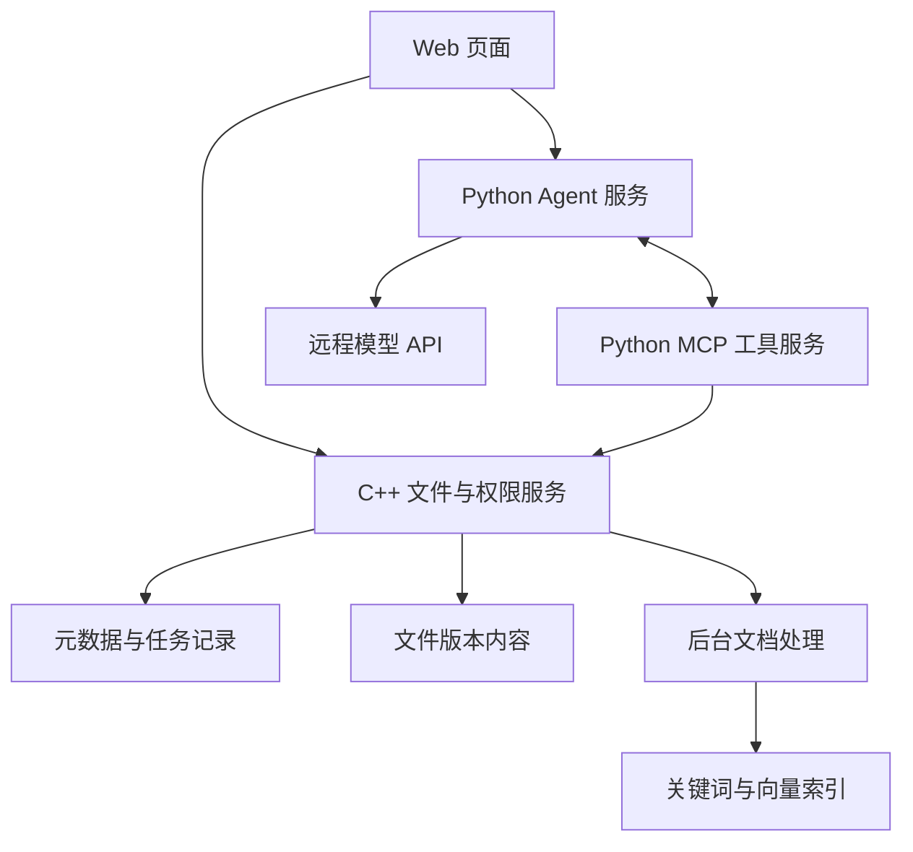

# Smart Docs Platform

面向小型项目团队的文档管理与智能整理平台。项目计划以 C++ 文件服务为业务核心，通过 Python MCP/Agent 服务提供受控的资料检索、交接核查和智能归档能力。

> 当前代码已实现 M1 文件业务候选版本：登录会话、项目角色、目录、分片续传、不可变版本、受保护下载/PDF Range、文件状态操作和同源 Web 工作台。由于小规格验收主机发生资源耗尽事故，当前提交尚未完成安全环境中的最终二十轮阶段门验收，因此不能宣称 M1 已关闭。M2 检索、M3 MCP/Agent、M4 归档交接和 M5 最终验收仍未实现。详细边界见[需求文档](./团队文档管理与智能整理平台_需求文档.md)。

## 当前实现

当前 C++ 服务提供：

- Linux `epoll` I/O 多路复用；
- HTTP/1.1 边界校验、路由、流式请求体和文件响应；
- PBKDF2 密码、服务端会话和同源 Cookie 安全边界；
- 项目级 `admin/editor/reader` 权限、成员和逻辑目录；
- MySQL 版本化迁移、RAII 连接池、事务与审计记录；
- 分片上传、断点恢复、幂等完成和启动核对；
- 不可变文件版本、重命名/移动、软删除/还原和远程 AI 授权标记；
- 鉴权下载、单段 Range、PDF 内联预览和同源 M1 Web 工作台。

网络服务器基线来自 [`markparticle/WebServer`](https://github.com/markparticle/WebServer) 的源码快照，固定于提交 `3b375204a80cc0de1caf5c076e95d6b5567a8159`；上述 M1 业务是在本仓库中实现的。许可证和来源信息见“开源来源与许可证”。

M1 的[单机部署手册](./docs/deployment/m1-single-host.md)、[HTTP API](./docs/api/m1-http-api.md)、[验收说明](./docs/evidence/m1/README.md)和[资源耗尽事故记录](./docs/operations/2026-09-15-m1-acceptance-resource-exhaustion.md)均在仓库内维护。

## 规划架构



规划中的职责边界：

- **C++ 服务**：文件传输、版本、权限、幂等操作和最终写入检查；
- **Python MCP/Agent**：文档处理、受控工具接入和多步任务编排；
- **Web 页面**：文件工作台、上传任务、检索、Agent、归档确认和交接报告；
- **远程模型**：仅处理管理员明确允许远程 AI 使用的版本与片段。

## 仓库结构

```text
.
├── code/                 C++ WebServer 源码
├── config/               无密钥环境变量模板
├── db/migrations/        MySQL schema 迁移
├── resources/            M1 同源 Web 工作台
├── scripts/              迁移和隔离测试脚本
├── test/                 单元、集成及 M1 验收场景
├── docs/api/             HTTP API 文档
├── docs/deployment/      部署与运维文档
├── docs/evidence/        可复现验收说明和阶段证据
├── docs/operations/      生产/验收事故记录
├── webbench-1.5/         上游压力测试工具
├── docs/superpowers/     设计与实施计划
├── Makefile              根构建入口
├── LICENSE               Apache License 2.0
└── 团队文档管理与智能整理平台_需求文档.md
```

## 构建与运行

### 环境

- Linux
- 支持 C++14 的 GCC
- GNU Make
- MySQL 8 Server 与 MySQL Client 开发库
- OpenSSL 开发库
- Python 3（仅迁移辅助与测试）

Ubuntu/Debian 可安装基础依赖：

```bash
sudo apt update
sudo apt install build-essential libmysqlclient-dev libssl-dev mysql-server mysql-client
```

### 配置与数据库

服务器只从环境变量读取运行配置，不需要修改源码。复制 [`config/smart-docs.env.example`](./config/smart-docs.env.example) 到仓库外的受保护位置，填入独立 MySQL 数据库/用户和绝对存储根，然后执行：

```bash
set -a
. /path/to/protected/smart-docs.env
set +a
scripts/migrate.sh
```

迁移成功输出 `schema_version=2`。完整数据库、目录权限、systemd、HTTPS 和备份步骤见[单机部署手册](./docs/deployment/m1-single-host.md)。

### 编译

```bash
make -j1 server admin
```

生成 `bin/server` 和 `bin/smartdocs-admin`。小规格主机从单 job 构建开始，不要盲目提高并发。

### 运行

```bash
./bin/server
```

服务器启动前验证 MySQL、schema 版本、受控存储权限并执行上传状态核对；失败时不会以部分可用状态监听。浏览器入口为 `/app.html`。

### 测试与验收

普通测试目标：

```bash
make -j1 test
```

完整 M1 验收会执行清理构建、隔离 MySQL、真实 TCP 场景和二十轮进程故障恢复：

```bash
test/e2e/run_m1.sh
```

该命令资源消耗较高，默认单 job 并拒绝超过 `min(在线 CPU 数, 2)` 的构建并行度。同一时间只运行一个实例；受限服务器先阅读[事故记录](./docs/operations/2026-09-15-m1-acceptance-resource-exhaustion.md)。

## 开发路线

1. **M1 文件业务**：候选实现已完成，等待安全环境中的最终证据审阅和阶段门关闭；
2. **M2 文档检索**：PDF/TXT/Markdown 解析、索引状态、混合检索和出处定位；
3. **M3 MCP 与 Agent**：实现五项业务工具和可观察的多步调用；
4. **M4 归档与交接**：方案确认、事务执行、交接清单和带引用报告；
5. **M5 验收与展示**：固定任务、故障测试、部署文档和可复现实验记录。

除上述 M1 候选实现外，路线仍是计划。阶段验收以需求文档和与目标提交绑定的实际测试证据为准。

## 安全说明

- API 密钥和真实数据库密码只放在仓库外的受保护文件中；不要提交 Cookie、证据临时目录、真实企业文件或其他敏感数据。
- 上传内容不能通过公开静态目录绕过权限检查。
- Agent 的写操作必须由服务端验证真实用户确认，模型输出不能代替授权。

## 开源来源与许可证

C++ WebServer 基线来源：[`markparticle/WebServer`](https://github.com/markparticle/WebServer)，上游提交 `3b375204a80cc0de1caf5c076e95d6b5567a8159`。

上游代码依照 Apache License 2.0 发布。本仓库保留其 [`LICENSE`](./LICENSE)；后续修改继承文件时应保留适用的版权和归属声明，并按许可证要求标示修改。本项目并非上游作者提供或背书的官方发行版。
