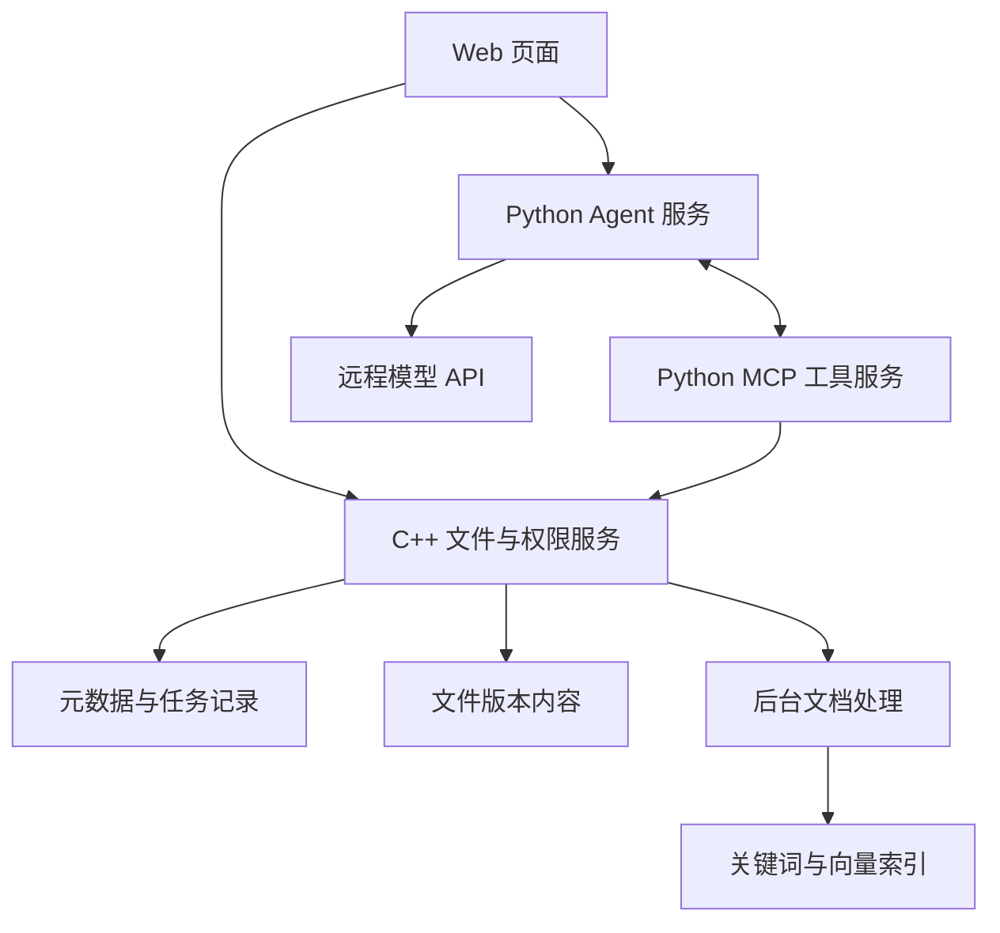

# Smart Docs Platform

面向小型项目团队的文档管理与智能整理平台。项目计划以 C++ 文件服务为业务核心，通过 Python MCP/Agent 服务提供受控的资料检索、交接核查和智能归档能力。

> M1 文件业务已于 2026-10-17 在当前 ECS 的资源限额内完成验收并审阅证据：登录会话、项目角色、目录、分片续传、不可变版本、受保护下载/PDF 翻页、文件状态操作和同源 Web 工作台。M1 被测干净提交为 `ed14dcf6029e53ac7106847fa456b3067af0147c`，M1 交接提交仅更新文档和归档证据。用户随后批准启动 M2 并选择方案 A：当前已实现 PDF/TXT/Markdown 本地解析、持久任务、可信本机 worker、事务式关键词/向量发布、固定版本来源读取、搜索工作台及有界混合检索后端/同源网关。需单独部署启用 worker、编码服务和网关；M2 阶段验收及 M3–M5 仍未完成。详细边界见[需求文档](./团队文档管理与智能整理平台_需求文档.md)。

## 当前实现

当前 C++ 服务提供：

- Linux `epoll` I/O 多路复用；
- HTTP/1.1 边界校验、路由、流式请求体和文件响应；
- PBKDF2 密码、服务端会话和同源 Cookie 安全边界；
- 项目级 `admin/editor/reader` 权限、成员和逻辑目录；
- MySQL 版本化迁移、RAII 连接池、事务与审计记录；
- 分片上传、断点恢复、幂等完成和启动核对；
- 不可变文件版本、带创建者/UTC 更新时间的文件元数据、重命名/移动、软删除/还原和远程 AI 授权标记；
- 鉴权下载、单段 Range、PDF 内联预览和同源 M1 Web 工作台。

网络服务器基线来自 [`markparticle/WebServer`](https://github.com/markparticle/WebServer) 的源码快照，固定于提交 `3b375204a80cc0de1caf5c076e95d6b5567a8159`；上述 M1 业务是在本仓库中实现的。许可证和来源信息见“开源来源与许可证”。

M1 的[单机部署手册](./docs/deployment/m1-single-host.md)、[HTTP API](./docs/api/m1-http-api.md)、[验收说明](./docs/evidence/m1/README.md)和[资源耗尽事故记录](./docs/operations/2026-09-15-m1-acceptance-resource-exhaustion.md)均在仓库内维护。

### M2 当前增量：本地解析、持久任务与 worker 闭环

已新增 [TXT/Markdown 解析函数](./python/smartdocs/text_parser.py)，仅依赖 Python 3.10+ 标准库：严格 UTF-8、BOM/换行规范化、有界分块、固定文件/版本 ID、原始内容哈希、稳定片段 ID 和行号/字符区间。文档中的指令保留为文本，不执行。不读取 API key、不访问网络、不读取任意文件路径。

默认解析上限为 8 MiB 输入、2,000,000 个字符、每片段 1,200 个字符、最多 2,000 个片段；超限或乱码明确失败，不返回静默截断结果。偏移是规范化文本的 Unicode 码点位置 `[start, end)`，行号从 1 起，不是原始字节或浏览器 UTF-16 偏移。调用方须在读取文件前鉴权并限制读取大小；当前本机 worker 通过下述 C++ 受控内容接口执行。

新增 [PDF 解析入口](./python/smartdocs/pdf_parser.py)：pypdf 6.21.0 在独立子进程中提取文字，片段绑定原始 PDF 哈希、固定版本及从 1 起的物理页码，字符/行号按页计数。最多 300 页，单页内容及嵌套 Form 内容流解压后的合计最多 16 MiB（同一 Form 只计一次）；子进程虚拟内存最多 256 MiB、CPU 时间 10 秒、墙钟默认 15 秒、输出文件 16 MiB，继承到的更紧限制不会被放宽。超时会终止并回收子进程，不返回部分成功。

全部无文本时明确失败；部分页无文本时返回 `pages_without_text`，这些可能是空白页或扫描页，不能宣称全页覆盖。没有 OCR，不接收密码；空密码可读取的加密 PDF 可以提取，其余明确拒绝。依赖缺失、损坏、超限和异常退出均返回不带原文的错误码。pypdf 提取警告（例如嵌套对象缺失或循环）也按失败处理，不把库返回的部分文本当完整结果；这是一项保守策略，可能拒绝部分可被阅读器容错打开的 PDF。子进程清空环境，资源限额不等于文件/网络安全沙箱；worker 必须非 root 运行、由 C++ 鉴权。

PDF 依赖安装到仓库外虚拟环境，按 [requirements](./python/requirements.txt) 校验 wheel 哈希，不安装可选 OCR/加密组件：

```bash
python3 -m venv /path/to/smartdocs-venv
/path/to/smartdocs-venv/bin/python -m pip install --require-hashes --only-binary=:all: -r python/requirements.txt
```

当前服务器 Python 3.10 缺少 ensurepip，本次没有修改系统软件包，而是使用 `python3 -m venv --without-pip`，再用现有 pip 的 `--target /path/to/smartdocs-venv/lib/python3.10/site-packages` 将同一锁定依赖装入该环境。其他 Python 版本需使用对应的 site-packages 路径，不要安装到系统环境。

解析器增量的小夹具测试 **28/28** 通过（文本 13、PDF 15），包含真实 PDF 提取、嵌套流/不完整提取拒绝、超时回收和子进程 300 MiB 分配被 256 MiB 内存限制拒绝；不代表最大规模性能验收。下述命令现在也包含 worker 测试，需允许本机回环 socket（在仓库根目录运行）：

```bash
(
  ulimit -v 524288
  ulimit -t 60
  PYTHONPATH=python timeout 90s /path/to/smartdocs-venv/bin/python -B -m unittest discover -s test/python -p 'test_*.py' -v
)
```

只测试 TXT/Markdown 时，可用系统 Python 运行 `PYTHONPATH=python python3 -B -m unittest discover -s test/python -p 'test_text_parser.py' -v`，无需 PDF 依赖。

新增 C++ [持久任务接口与迁移说明](./docs/api/m2-processing-api.md)：reader 查询，editor/admin 取消和人工重试；pending 上限 100、running 上限 1，队列满仍保存上传文件；重启将运行中任务标记 interrupted，旧 attempt 不能回写新尝试。任务状态接口已复用项目权限和同源检查。

该增量在当前 ECS 受限单元中通过完整 C++ 回归 **100/100**（0 失败、0 跳过）及真实 schema 2→3 升级/重放检查；没有迁移原有业务库。测试范围、源哈希及并发覆盖缺口见[任务验证记录](./docs/superpowers/plans/2026-10-17-m2-processing-jobs.md#2026-10-17-验证结果)。

后续结果发布增量新增 C++ 有界结果校验、不可变片段持久化、事务式本地 FULLTEXT 发布及鉴权的固定版本来源读取；解析、关键词和向量状态分开，内部资料不请求远程向量化。详见[发布计划与证据](./docs/superpowers/plans/2026-10-17-m2-result-publication.md)和[来源 API](./docs/api/m2-processing-api.md)。

该发布增量完整 C++ 回归 **112/112**；审阅后仅补强测试，同一生产代码再通过结果校验 **7/7**、任务与来源 **19/19**、103 文件升级夹具；Python 解析回归 **28/28**。定向复验与全量回归存在重叠，不累计成更大的完整验收数字。

新增 [本机 Python worker](./python/smartdocs/worker.py)：受独立 bearer 保护的 C++ 回环接口领取任务、流式读取受控版本、执行真实解析并原子发布结果。单 worker 锁先于恢复，重启后的 interrupted 等待人工重试；取消/新版覆盖阻止旧 attempt 发布。仅 publish/fail 的传输失败或 5xx 最多原样重放一次，不把响应丢失当作事务失败。普通用户 JSON 限额不变，worker 结果最多 16 MiB。

worker 增量的完整 C++ 回归 **121/121**（0 失败、0 跳过）、Python **39/39**、隔离数据库真实 HTTP **7/7** 通过；包括三种格式、中文 FULLTEXT、60 万字符/500 块结果、损坏/不支持文件仍可下载、取消/新版冲突、单实例锁、C++ 重启与人工重试。使用当前 ECS 的非 root 受限单元串行验证，未迁移原有业务库。部署配置及复现命令见 [worker 手册](./docs/deployment/m2-local-worker.md)，完整构建/回归证据见 [worker 计划](./docs/superpowers/plans/2026-10-17-m2-local-worker.md)。

新增同源、会话鉴权的 [本地搜索 API](./docs/api/m2-search-api.md)：metadata 支持名称子串及空查询分页发现未解析资料；keyword 返回当前已发布版本的真实片段与固定出处。支持目录/MIME 条件、有限分页和覆盖警告，返回正文前重新检查候选状态。仅本地普通阅读，不可代替 Agent 外发授权。后端测试范围和限制见[搜索增量证据](./docs/superpowers/plans/2026-10-17-m2-local-search.md)。

`/app.html` 新增本地搜索区：文件名/正文关键词、精确目录及 MIME 条件、上一页/下一页、索引覆盖快照与限制提示。点击出处重新鉴权读取固定版本/片段，历史版本明确标记，PDF 链接绑定具体页码；未解析资料显示状态而非虚构正文。项目/条件切换、文件变更和恢复上传完成会清空旧结果；不把片段作为 HTML 渲染。不增加前端依赖，手机使用单列布局。前端验证和边界见[搜索工作台记录](./docs/superpowers/plans/2026-10-17-m2-search-ui.md)。

搜索后端增量完整 C++ 回归 **127/127**（0 失败、0 跳过），Python **39/39**，扩展后的真实 HTTP **7/7**；覆盖中文/英文/短词/停用词、跨项目隔离、分页、同一文件多片段、候选读取后的版本/删除/移动等状态变化，以及真实 worker 发布后的搜索和来源读取。仍为当前 ECS 上串行、非 root、受限测试，无生产部署或模型调用。

搜索前端增量另通过新交互 **7/7**、原 UI 行为 **18/18**、页面契约 **8/8**、浏览器工具自测 **12/12**；真实 Chrome + 本地模拟 HTTP API 场景通过，覆盖 6 种屏宽和文件变更竞态。未重跑上述后端套件或完整 M1 验收，不将模拟 API 浏览器测试计作新的真实 C++ 端到端验收。

另完成[小型 CPU 语义向量可行性验证](./docs/evidence/m2/vector-probe/README.md)：固定公开 ONNX 模型的 4 个预设查询首位命中 3 个；发现默认 128 token 截断及原始向量未归一化的问题。后续[有界本地编码器](./docs/evidence/m2/bounded-embeddings/README.md)已验证完整窗口覆盖、显式归一化、进程资源限制与超时回收：1,200 字符样例分为 8 窗，真实模型子进程峰值 RSS 约 737 MiB，Python 回归 47/47 通过。可选依赖单独锁定，未混入解析 worker；该编码器仍是独立组件，后续发布链路状态见下。

后续 [C++ 向量发布增量](./docs/evidence/m2/vector-publication/README.md)复用有界任务队列，按具体版本批准领取片段、分批保存向量，全部片段提交后才标记向量就绪。撤销/重新批准、重试和重启均阻止旧 attempt 发布；向量失败不抹掉本地关键词能力。完整 C++ 回归 135/135、隔离库升级与重放通过。数据库要求 schema 5，但本机业务库未迁移。

新增 [Python 向量调度与隔离编码服务](./docs/deployment/m2-vector-worker.md)：轻量 worker 经 C++ 领取获批版本，以受保护 Unix socket 调用禁网编码服务，再分批提交真实模型结果。异常发布回执立即退出，不能推断事务失败；重启恢复、失败与人工重试保持持久状态。Python 回归 59/59、真实 C++/临时 MySQL/模型闭环 3/3 通过，覆盖 9 片段两批持久化、撤销后拒绝发布和锁/恢复/重试。首次资源受限运行出现过模型超时，缩小临时测试库缓存后复验通过；不据此承诺任意冷启动耗时。详见[本轮证据](./docs/evidence/m2/vector-worker/README.md)。

新增[有界混合检索后端](./docs/api/m2-search-api.md#有界混合检索)：Python 查询适配层在 C++ 鉴权后复用禁网编码器；C++ 对已批准的当前版本进行关键词/真实持久向量双路召回、RRF 去重融合及返回前复查。单次最多扫描 4096 个窗口，超时、超限、索引缺失或编码不可用明确降级；部分向量覆盖和候选池截断明确报告。没有新增向量数据库或模型依赖。后续网关和页面接入见下；尚不是 MCP 服务。

该混合后端增量通过 Python 64/64、C++ 处理/搜索定向回归 40/40、真实 HTTP/数据库/模型闭环 4/4；联合测试正常退出，出现内存节流但无 OOM。真实模型小夹具验证中文查询召回英文恢复文档及编码失败降级，不代表业务准确率评测。详见[验证证据及边界](./docs/evidence/m2/hybrid-search/README.md)。

工作台新增 Hybrid 模式，通过[同源网关](./docs/deployment/m2-hybrid-search.md)复用现有查询协调器。网关只监听回环、最多两个连接、4 KiB 请求，不接受调用方指定身份、模型向量或网络目的地；先 C++ 鉴权，再编码并重新鉴权。页面明确展示“仅获批当前版本”、实际检索方式、向量覆盖、命中通道及关键词降级，继续使用固定版本出处和防陈旧响应机制。没有新增依赖或远程 API；需要按手册配置反向代理，不能把 Python 私有入口直接暴露公网。

该网关增量通过 Python 74/74、前端行为 27/27、真实网关/C++/数据库/模型回归 4/4；另有真实 Chrome + 模拟 HTTP API 的 6 屏宽页面验证。后两者是分开的验证层，不声称浏览器直通真实模型验收。资源受限运行仅出现内存节流，无 OOM；完整范围、失败修正及截图见[网关与页面证据](./docs/evidence/m2/hybrid-gateway/README.md)。

工作台新增固定版本的处理状态面板：重新打开页面后从服务端发现持久任务，分别显示解析、关键词及向量状态；当前版本的可写用户可取消/人工重试，历史版本与 reader 只读。采用手动刷新，不轮询、不自动重试；回执不明确时先要求刷新真实状态。任务操作及远程 AI 批准变化清除旧搜索结果。接口与状态边界见[处理 API](./docs/api/m2-processing-api.md)。

该状态面板增量通过完整 C++ **141/141**、前端行为 **37/37**、页面契约 **8/8**，以及真实 Chrome→C++→临时 MySQL→本地 TXT 解析组合场景 **1/1**（含六屏宽、reader 拒绝写入和删除后拒绝读取）。实际链路还发现并修复搜索/处理 JS 静态白名单遗漏；审查发现的退出登录竞态也有回归覆盖。失败过程、资源限制和截图见[验证记录](./docs/evidence/m2/processing-ui/README.md)。这轮没有模型调用，不代表浏览器直通混合模型或 M2 全阶段验收。

新增[真实浏览器→混合网关→本地模型组合验收](./docs/evidence/m2/hybrid-browser/README.md)，**当前尚未通过**：Python 74/74、JS 37/37 及隔离库迁移通过，但浏览器与模型共用原资源限额时出现 `embedding_timeout`，一次显式人工重试仍失败，最终编码服务也达到预设总运行时限。未进入搜索断言，不可声称浏览器直通模型成功。全部临时服务已停止，生产 MySQL 保持运行；有内存节流但没有 OOM。生产代码未改，没有扩容或放宽限额；失败日志与复现条件已归档，冷加载和总服务寿命因素仍需进一步区分。

后续[分层诊断](./docs/evidence/m2/encoder-cold-start/README.md)在新鲜编码服务内重现失败，排除了总寿命到期因素：首次模型文件校验耗时约 48.5 秒，CPU 不到 1 秒；重试加载完成时已用约 47.7 秒、编码进程峰值 RSS 约 727 MiB，随后触发原 60 秒截止期。当前瓶颈证据指向受限磁盘读取、内存回收与每请求重复冷加载，而非已证实的 CPU 算力不足或 OOM。诊断未修改生产逻辑，M2 验收仍未通过。

另做了[受控预初始化复用实验](./docs/evidence/m2/warm-encoder-spike/README.md)，**仍未通过组合验收**：同一共享配额内预热成功，但先预热后开浏览器时 Chrome 会话创建失败；先开浏览器再预热时初始化约 138 秒，随后 worker 领取任务发生传输失败、清理请求超时。两轮均未进入编码请求，不能宣称请求复用有效。无 OOM，全部临时进程已回收，生产 MySQL 保持运行；原型仅归档为实验材料，不安装生产服务、不提高原请求上限、不消耗 DeepSeek token。下一步需量化常驻内存及本机接口延迟，不能仅凭预热成功就关闭 M2 或认定必须扩容。

本机 worker 默认关闭，尚未安装为生产常驻服务；M2 尚未完成阶段验收。这不是大文件性能验收，也未重跑 M1 全套浏览器验收。未调用远程模型 API 或消耗 DeepSeek token。详见[方案 A 设计](./docs/superpowers/specs/2026-10-17-m2-document-processing-design.md)、[文本增量](./docs/superpowers/plans/2026-10-17-m2-text-parser.md)、[PDF 增量](./docs/superpowers/plans/2026-10-17-m2-pdf-parser.md)与[任务增量计划](./docs/superpowers/plans/2026-10-17-m2-processing-jobs.md)。DeepSeek 聊天凭据不能直接作为向量能力已验证的证据。

后续[内存诊断与修正](./docs/evidence/m2/encoder-memory/README.md)将真实编码样例的编码后 RSS 从约 722 MiB 降至 638 MiB：只关闭现有 ONNX CPU 内存池，没有部署常驻模型或增加依赖。两组 9 个窗口完整结果一致，修改后 Python 回归 75/75、真实新子进程校验 1/1 通过；仍保留原 60 秒截止期。没有重跑浏览器/数据库组合，不能据此宣称 M2 已通过；未使用 DeepSeek token。

## 规划架构


```mermaid
flowchart TB
    UI[Web 页面] --> CPP[C++ 文件与权限服务]
    UI --> AG[Python Agent 服务]
    AG <--> MCP[Python MCP 工具服务]
    MCP --> CPP
    CPP --> META[元数据与任务记录]
    CPP --> FILE[文件版本内容]
    CPP --> JOB[后台文档处理]
    JOB --> INDEX[关键词与向量索引]
    AG --> API[远程模型 API]
```

规划中的职责边界：

- **C++ 服务**：文件传输、版本、权限、幂等操作和最终写入检查；
- **Python MCP/Agent**：文档处理、受控工具接入和多步任务编排；
- **Web 页面**：文件工作台、上传任务、检索、Agent、归档确认和交接报告；
- **远程模型**：仅处理管理员明确允许远程 AI 使用的版本与片段。

## 仓库结构

```text
.
├── code/                 C++ WebServer 源码
├── python/smartdocs/     M2 本地解析与可信本机 worker
├── config/               无密钥环境变量模板
├── db/migrations/        MySQL schema 迁移
├── resources/            M1 同源 Web 工作台
├── scripts/              迁移和隔离测试脚本
├── test/                 单元、集成及 M1 验收场景
├── docs/api/             HTTP API 文档
├── docs/deployment/      部署与运维文档
├── docs/evidence/        可复现验收说明和阶段证据
├── docs/operations/      生产/验收事故记录
├── webbench-1.5/         上游压力测试工具
├── docs/superpowers/     设计与实施计划
├── Makefile              根构建入口
├── LICENSE               Apache License 2.0
└── 团队文档管理与智能整理平台_需求文档.md
```

## 构建与运行

### 环境

- Linux
- 支持 C++14 的 GCC
- GNU Make
- MySQL 8 Server 与 MySQL Client 开发库
- OpenSSL 开发库
- Python 3（迁移辅助与测试）；M2 解析模块要求 Python 3.10+

Ubuntu/Debian 可安装基础依赖：

```bash
sudo apt update
sudo apt install build-essential libmysqlclient-dev libssl-dev mysql-server mysql-client
```

### 配置与数据库

服务器只从环境变量读取运行配置，不需要修改源码。复制 [`config/smart-docs.env.example`](./config/smart-docs.env.example) 到仓库外的受保护位置，填入独立 MySQL 数据库/用户和绝对存储根，然后执行：

```bash
set -a
. /path/to/protected/smart-docs.env
set +a
scripts/migrate.sh
```

迁移成功输出 `schema_version=5`。升级前停止应用并备份数据库及文件，先阅读 [M2 迁移说明](./docs/api/m2-processing-api.md)。目录权限、systemd、HTTPS 和备份基线见 [M1 单机部署手册](./docs/deployment/m1-single-host.md)（其中 schema 2 为历史基线）。

### 编译

```bash
make -j1 server admin
```

生成 `bin/server` 和 `bin/smartdocs-admin`。小规格主机从单 job 构建开始，不要盲目提高并发。

### 运行

```bash
./bin/server
```

服务器启动前验证 MySQL、schema 版本、受控存储权限并执行上传状态核对；失败时不会以部分可用状态监听。浏览器入口为 `/app.html`。

### 测试与验收

普通测试目标：

```bash
make -j1 test
```

完整 M1 验收会执行清理构建、隔离 MySQL、真实 TCP/浏览器场景和二十轮进程故障恢复；验收主机还需提供匹配版本的 Chrome/Chromium 与 ChromeDriver，可用 `SMARTDOCS_BROWSER_BIN`、`SMARTDOCS_WEBDRIVER_BIN` 指定：

```bash
test/e2e/run_m1.sh
```

该命令资源消耗较高，默认单 job 并拒绝超过 `min(在线 CPU 数, 2)` 的构建并行度。同一时间只运行一个实例；受限服务器先阅读[事故记录](./docs/operations/2026-09-15-m1-acceptance-resource-exhaustion.md)。

2026-10-17 16:11:47–16:25:29（北京时间），按[同机受限验收方案](./docs/operations/2026-10-17-m1-same-host-limited-run.md)完成整轮验收：独立干净代码副本、非 root 浏览器沙箱、整个测试组 1600 MiB 内存上限、单核 CPU 配额、磁盘读写各 5 MB/s 与 200 IOPS。未扩容、未增加 swap，原 MySQL 服务保持运行。

- C++ 单元／集成测试 **90/90**，UI 契约 **8/8**，UI 行为 **18/18**；失败和跳过均为零；驱动自测 **26/26**。
- HTTP **9/9** 场景、44 项断言；真实浏览器 **2/2** 场景、20 项断言，涵盖刷新续传、错文件零 PUT、仅补缺失分片及 PDF 两页渲染。
- 四路各 **32 MiB**、**8 MiB** 分片；上传、合并、下载均实测四路重叠且最终哈希一致。服务峰值 RSS 增长 **1,515,520 bytes（约 1.45 MiB）**，严格小于 64 MiB 门槛。
- 中断恢复 **20/20** 轮、305 项断言，六类故障分布 **4/4/4/3/3/2**；无重复版本或半发布内容。

完整[验收汇总](./docs/evidence/m1/verified/summary.md)、[机器结果](./docs/evidence/m1/verified/results.json)、[环境](./docs/evidence/m1/verified/environment.txt)和两张已人工审阅的 [PDF 第 1 页](./docs/evidence/m1/verified/browser-artifacts/pdf-page-1.png)／[第 2 页](./docs/evidence/m1/verified/browser-artifacts/pdf-page-2.png)已归档。需求映射及 M2+ 排除项见 [M1 gate matrix](./docs/evidence/m1/gate-matrix.md)。此次验收不代表生产服务、TLS 或备份恢复演练已经部署完成，也不是吞吐量或长期稳定性承诺。当前 ECS 后续完整验收仍须使用资源限额，不要直接运行未受限命令。

## 开发路线

1. **M1 文件业务**：实现、完整受限验收和证据审阅已完成，阶段关闭；
2. **M2 文档检索**：进行中，已实现本地解析、持久任务与人工重试界面、worker 通道、片段/关键词及向量发布、固定版本来源读取及元数据/关键词/混合检索工作台；阶段综合验收待完成；
3. **M3 MCP 与 Agent**：实现五项业务工具和可观察的多步调用；
4. **M4 归档与交接**：方案确认、事务执行、交接清单和带引用报告；
5. **M5 验收与展示**：固定任务、故障测试、部署文档和可复现实验记录。

M1 已关闭，M2 目前实现上述解析、任务及检索增量，尚未完成整个阶段验收，M3–M5 仍是计划。阶段验收以需求文档和与目标提交绑定的实际测试证据为准。

## 安全说明

- API 密钥和真实数据库密码只放在仓库外的受保护文件中；不要提交 Cookie、证据临时目录、真实企业文件或其他敏感数据。
- 上传内容不能通过公开静态目录绕过权限检查。
- Agent 的写操作必须由服务端验证真实用户确认，模型输出不能代替授权。

## 开源来源与许可证

C++ WebServer 基线来源：[`markparticle/WebServer`](https://github.com/markparticle/WebServer)，上游提交 `3b375204a80cc0de1caf5c076e95d6b5567a8159`。

上游代码依照 Apache License 2.0 发布。本仓库保留其 [`LICENSE`](./LICENSE)；后续修改继承文件时应保留适用的版权和归属声明，并按许可证要求标示修改。本项目并非上游作者提供或背书的官方发行版。
