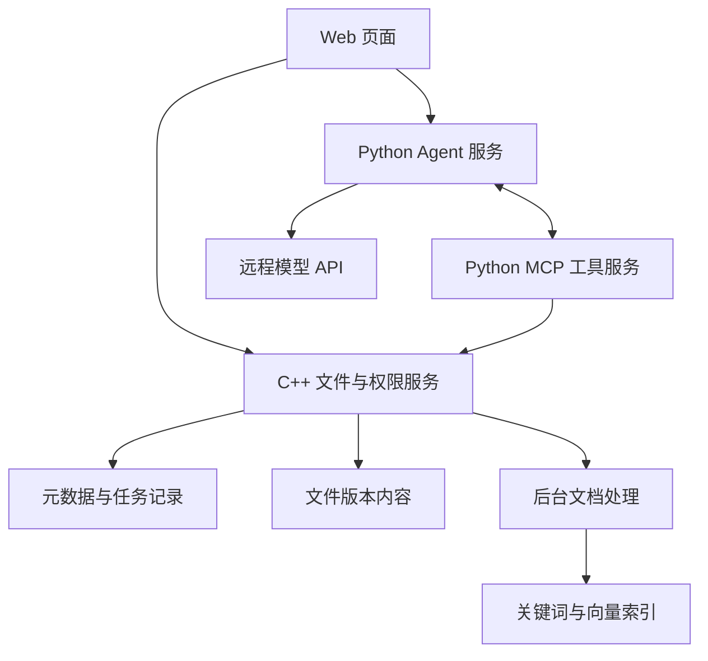

# Smart Docs Platform WebServer Bootstrap Implementation Plan

> **For agentic workers:** REQUIRED SUB-SKILL: Use superpowers:subagent-driven-development (recommended) or superpowers:executing-plans to implement this plan task-by-task. Steps use checkbox (`- [ ]`) syntax for tracking.

**Goal:** Import the approved `markparticle/WebServer` source snapshot, replace its project README with an honest Smart Docs Platform README, verify the baseline, and push a new `main` history to the empty target repository.

**Architecture:** Keep the upstream C++14 Epoll/Reactor server unchanged as the initial network-service baseline. Preserve the Apache-2.0 license and identify the exact upstream commit, while treating all Smart Docs file, retrieval, MCP, Agent, and frontend capabilities as roadmap work rather than current behavior.

**Tech Stack:** C++14, Linux Epoll, POSIX threads, MySQL client library, GNU Make, Git, Markdown

**Spec:** `docs/superpowers/specs/2026-09-13-webserver-bootstrap-design.md`

## Global Constraints

- Import upstream commit `3b375204a80cc0de1caf5c076e95d6b5567a8159` from `https://github.com/markparticle/WebServer.git`.
- Do not import the upstream `.git` directory or its commit history.
- Preserve the upstream Apache License 2.0 file and attribution.
- Preserve `团队文档管理与智能整理平台_需求文档.md` unchanged.
- Do not claim that planned Smart Docs features or target performance figures are implemented or verified.
- Do not modify upstream C++ source in this bootstrap.
- Push with ordinary fast-forward semantics; never force-push.

---

### Task 1: Import the upstream C++ WebServer snapshot

**Files:**
- Create: `.gitignore`
- Create: `LICENSE`
- Create: `Makefile`
- Create: `build/Makefile`
- Create: `code/**`
- Create: `readme.assest/**`
- Create: `resources/**`
- Create: `test/**`
- Create: `webbench-1.5/**`
- Preserve: `团队文档管理与智能整理平台_需求文档.md`
- Preserve: `docs/superpowers/specs/2026-09-13-webserver-bootstrap-design.md`

**Interfaces:**
- Consumes: the approved upstream snapshot at commit `3b375204a80cc0de1caf5c076e95d6b5567a8159`.
- Produces: the original C++ source tree and build entry point `make`, without nested Git metadata.

- [ ] **Step 1: Record the pre-import failure**

Run:

```bash
test -f Makefile
```

Expected: exit status `1`, proving the C++ baseline is not already present.

- [ ] **Step 2: Verify the downloaded source revision**

Run:

```bash
git -C /tmp/smart-docs-upstream.0h77GP/WebServer rev-parse HEAD
```

Expected output:

```text
3b375204a80cc0de1caf5c076e95d6b5567a8159
```

- [ ] **Step 3: Copy only the approved snapshot contents**

Run from the Smart Docs repository root:

```bash
cp -a /tmp/smart-docs-upstream.0h77GP/WebServer/.gitignore \
      /tmp/smart-docs-upstream.0h77GP/WebServer/LICENSE \
      /tmp/smart-docs-upstream.0h77GP/WebServer/Makefile \
      /tmp/smart-docs-upstream.0h77GP/WebServer/build \
      /tmp/smart-docs-upstream.0h77GP/WebServer/code \
      /tmp/smart-docs-upstream.0h77GP/WebServer/readme.assest \
      /tmp/smart-docs-upstream.0h77GP/WebServer/resources \
      /tmp/smart-docs-upstream.0h77GP/WebServer/test \
      /tmp/smart-docs-upstream.0h77GP/WebServer/webbench-1.5 \
      .
```

The generated `/tmp/.../bin/server` is deliberately excluded. The upstream `readme.md` is also excluded because Task 2 creates the repository-specific `README.md`.

- [ ] **Step 4: Verify the import boundary**

Run:

```bash
test -f Makefile
test -f code/main.cpp
test -f LICENSE
test ! -e code/.git
test ! -e resources/.git
test ! -e readme.md
git status --short
```

Expected: every `test` succeeds; Git lists the imported source as untracked and still lists no nested `.git` directory.

### Task 2: Replace the upstream README with the Smart Docs project README

**Files:**
- Create: `README.md`

**Interfaces:**
- Consumes: the imported C++ source layout and the approved requirements document.
- Produces: an accurate entry page that distinguishes the buildable WebServer baseline from the Smart Docs roadmap.

- [ ] **Step 1: Demonstrate that project documentation is missing**

Run:

```bash
test -f README.md
```

Expected: exit status `1`.

- [ ] **Step 2: Create `README.md` with the approved content**

Create this document:

```markdown
# Smart Docs Platform

面向小型项目团队的文档管理与智能整理平台。项目计划以 C++ 文件服务为业务核心，通过 Python MCP/Agent 服务提供受控的资料检索、交接核查和智能归档能力。

> 当前仓库处于 WebServer 基线阶段。已导入并可构建的是 C++ 网络服务器；分片上传、文件版本、项目权限、文档检索、MCP 工具、Agent 和平台页面仍属于后续开发范围。详细边界见[需求文档](./团队文档管理与智能整理平台_需求文档.md)。

## 当前基线

当前 C++ WebServer 提供：

- Linux `epoll` I/O 多路复用；
- Reactor 并发模型与线程池；
- HTTP 请求解析和静态资源响应；
- 自动扩展缓冲区；
- 基于小根堆的空闲连接定时器；
- 同步/异步日志；
- MySQL 连接池和示例登录注册流程。

这些能力来自 [`markparticle/WebServer`](https://github.com/markparticle/WebServer) 的源码快照，固定于提交 `3b375204a80cc0de1caf5c076e95d6b5567a8159`。本仓库未沿用上游 Git 历史，许可证和来源信息见“开源来源与许可证”。

## 规划架构



规划中的职责边界：

- **C++ 服务**：文件传输、版本、权限、幂等操作和最终写入检查；
- **Python MCP/Agent**：文档处理、受控工具接入和多步任务编排；
- **Web 页面**：文件工作台、上传任务、检索、Agent、归档确认和交接报告；
- **远程模型**：仅处理管理员明确允许远程 AI 使用的版本与片段。

## 仓库结构

```text
.
├── code/                 C++ WebServer 源码
├── build/                服务端构建规则
├── resources/            当前上游示例静态资源
├── test/                 上游测试入口
├── webbench-1.5/         上游压力测试工具
├── docs/superpowers/     基线设计与实施计划
├── Makefile              根构建入口
├── LICENSE               Apache License 2.0
└── 团队文档管理与智能整理平台_需求文档.md
```

## 构建与运行

### 环境

- Linux
- 支持 C++14 的 GCC
- GNU Make
- MySQL Server 与 MySQL Client 开发库

Ubuntu/Debian 可安装基础依赖：

```bash
sudo apt update
sudo apt install build-essential libmysqlclient-dev mysql-server
```

### 数据库

当前上游示例会在 `code/main.cpp` 中读取 MySQL 连接参数。启动前请使用本地开发数据库并修改该文件中的主机端口、用户名、密码和数据库名；不要提交真实密码。

示例表结构：

```sql
CREATE DATABASE webserver;
USE webserver;
CREATE TABLE user (
    username CHAR(50) NULL,
    password CHAR(50) NULL
) ENGINE=InnoDB;
```

### 编译

```bash
make
```

生成文件为 `bin/server`。当前默认监听端口和数据库参数位于 `code/main.cpp`。

### 运行

```bash
./bin/server
```

当前版本启动时会连接 MySQL；仅完成编译不代表数据库配置或运行环境已经验证。

### 上游测试入口

```bash
make -C test
./test/test
```

测试内容继承自上游，不能代替 Smart Docs 需求文档中的业务、权限和故障恢复验收。

## 开发路线

1. **M1 文件业务**：项目角色、逻辑目录、分片续传、下载、版本和 PDF Range 支持；
2. **M2 文档检索**：PDF/TXT/Markdown 解析、索引状态、混合检索和出处定位；
3. **M3 MCP 与 Agent**：实现五项业务工具和可观察的多步调用；
4. **M4 归档与交接**：方案确认、事务执行、交接清单和带引用报告；
5. **M5 验收与展示**：固定任务、故障测试、部署文档和可复现实验记录。

路线是计划，不代表已经实现。阶段验收以需求文档和实际测试证据为准。

## 安全说明

- 当前上游示例包含源码内数据库参数，仅适用于本地基线验证；正式业务开发必须改为服务端配置或环境变量。
- 不要向仓库提交 API 密钥、数据库密码、真实企业文件或其他敏感数据。
- 上传内容不能通过公开静态目录绕过权限检查。
- Agent 的写操作必须由服务端验证真实用户确认，模型输出不能代替授权。

## 开源来源与许可证

C++ WebServer 基线来源：[`markparticle/WebServer`](https://github.com/markparticle/WebServer)，上游提交 `3b375204a80cc0de1caf5c076e95d6b5567a8159`。

上游代码依照 Apache License 2.0 发布。本仓库保留其 [`LICENSE`](./LICENSE)；后续修改继承文件时应保留适用的版权和归属声明，并按许可证要求标示修改。本项目并非上游作者提供或背书的官方发行版。
```

- [ ] **Step 3: Check README truthfulness and required attribution**

Run:

```bash
rg -n '当前仓库处于 WebServer 基线阶段|仍属于后续开发范围' README.md
rg -n 'markparticle/WebServer|3b375204a80cc0de1caf5c076e95d6b5567a8159|Apache License 2.0' README.md
test -f LICENSE
```

Expected: both searches return matching lines and the license check succeeds.

### Task 3: Build, commit, and publish the baseline

**Files:**
- Modify: Git index and repository-local configuration
- Create during verification only: `bin/server` (ignored build output)

**Interfaces:**
- Consumes: imported source, rewritten README, requirements, design, and this plan.
- Produces: a build-verified commit on `main`, tracking `origin/main` at `https://github.com/NoUmbrellaK/Smart-Docs-Platform.git`.

- [ ] **Step 1: Build the imported server**

Run:

```bash
make
test -x bin/server
```

Expected: compilation succeeds and `bin/server` is executable. The known upstream compiler warnings about unused local variables may remain because this bootstrap does not modify upstream C++ code.

- [ ] **Step 2: Verify repository contents and attribution before staging**

Run:

```bash
test "$(find . -mindepth 2 -type d -name .git -print -quit)" = ""
git check-ignore bin/server
git diff --check
git status --short
```

Expected: there is no nested `.git`; `bin/server` is ignored; `git diff --check` reports no whitespace errors; source and documentation are visible in status.

- [ ] **Step 3: Stage the bootstrap and review the exact commit**

Run:

```bash
git add .
git status --short
git diff --cached --stat
git diff --cached -- README.md
```

Expected: imported source, `README.md`, and this plan are staged; `bin/server`, `.DS_Store`, and upstream Git metadata are absent.

- [ ] **Step 4: Commit the code baseline**

Run:

```bash
git commit -m "chore: import C++ WebServer baseline"
```

Expected: one commit containing the approved snapshot, rewritten README, and implementation plan.

- [ ] **Step 5: Configure and verify the target remote without overwriting**

Run:

```bash
git remote add origin https://github.com/NoUmbrellaK/Smart-Docs-Platform.git
git ls-remote --heads origin
git remote -v
```

Expected: `git ls-remote --heads origin` prints no branches; both fetch and push URLs point to the target repository. If a branch appears, stop instead of pushing.

- [ ] **Step 6: Push `main` normally**

Run:

```bash
git push -u origin main
```

Expected: `main` is created on GitHub and local `main` tracks `origin/main`.

- [ ] **Step 7: Perform final verification**

Run:

```bash
git status --short --branch
git log --oneline --decorate -2
git ls-remote --heads origin main
```

Expected: the worktree is clean; two commits are shown; the remote `main` hash equals local `HEAD`.
