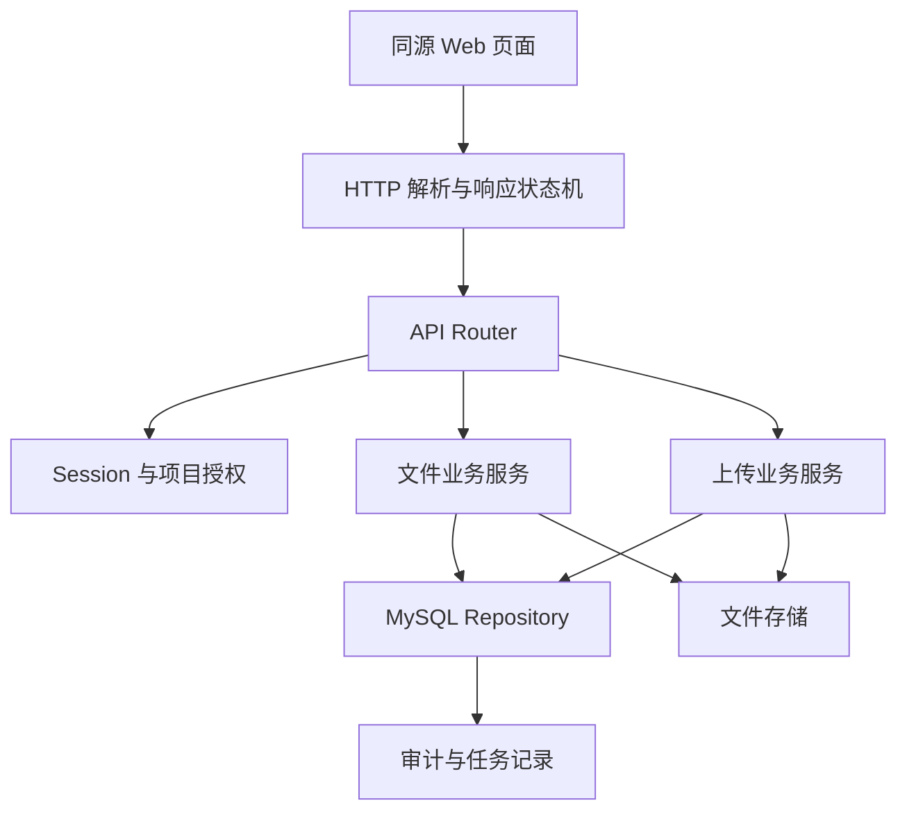
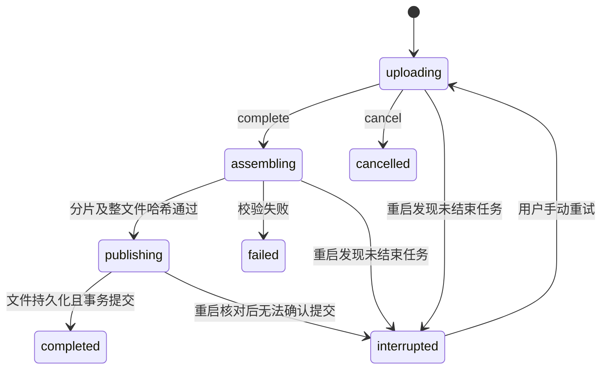

# Smart Docs Platform M1 文件业务设计

## 1. 目标与范围

M1 在现有 C++ WebServer 基线上交付可独立验收的文件业务：账号登录、项目与成员角色、逻辑目录、文件列表、分片上传与断点续传、文件版本、鉴权下载、单段 Range、PDF 浏览器预览、重命名、同项目移动、软删除与还原。

本设计只覆盖需求文档中的 M1。文档正文解析、索引、MCP、Agent、归档计划和交接报告分别留给 M2 至 M4；M1 只创建后续阶段需要的稳定文件/版本标识、远程 AI 使用状态和待处理任务记录，不提前实现后续业务。

M1 的完成条件不是“接口能够返回成功”，而是需求 F-01 至 F-04 的行为可运行，并为 T-01 至 T-09 中属于文件服务的部分留下自动化证据。

## 2. 已批准的技术方向

- 复用现有 WebServer 的 Linux `epoll`、连接管理、定时器、线程池和缓冲区。
- 重写现有 HTTP 请求/响应边界，不在旧的静态文件类中堆叠业务逻辑。
- 使用 MySQL 8.0 保存权威元数据，依靠事务、行锁和唯一约束保证并发一致性。
- 使用普通 Linux 文件系统保存不可变文件版本和上传暂存内容。
- C++ 服务是用户身份、项目权限、文件状态、版本发布和后续写操作的权威入口。
- 首版前端采用服务端同源托管的 HTML、CSS 和原生 ES Modules，不引入前端构建框架；复杂度确实超过原生模块可维护范围时再单独评审。
- JSON 使用固定版本的 `nlohmann/json` 单头文件；密码派生、摘要和随机令牌复用系统已有的 OpenSSL `libcrypto`，不自行实现密码学算法。

## 3. 组件边界



### 3.1 网络层

网络层只处理 HTTP 帧、连接状态和字节传输：

- 增量解析请求行、请求头和请求体，跨多次 `read` 保留状态。
- 根据 `Content-Length` 判断请求是否完整；不把二进制分片解释为 CRLF 文本。
- 请求头完成后先匹配路由并鉴权：小型 JSON 正文进入有限缓冲，分片正文交给有大小上限的流式 body sink，边写临时文件边计算摘要；未授权请求不会先落完整分片。
- 限制请求行、请求头和各类请求体大小。
- P0 拒绝 `Transfer-Encoding: chunked`、请求走私歧义和 HTTP pipelining，不伪装支持。
- 小型 JSON 响应进入写缓冲；文件响应保存文件描述符、偏移和剩余长度，由非阻塞 `sendfile` 分批发送。
- 一个连接同时只处理一个请求。当前响应完成后，才在 keep-alive 连接上解析下一请求。

网络层不知道项目、用户和文件规则。

### 3.2 路由与控制器

`ApiRouter` 按 HTTP 方法和规范化路径匹配控制器。控制器负责：

1. 解析并校验边界输入；
2. 从认证上下文获取当前用户，绝不接受请求体中的 `user_id` 作为身份；
3. 调用一个业务服务；
4. 将业务结果转换为统一 HTTP 响应。

控制器不直接拼 SQL，也不根据用户输入拼文件系统路径。

### 3.3 业务服务

- `AuthService`：登录、注销、会话校验和同源写请求保护。
- `ProjectService`：项目、成员和角色管理。
- `DirectoryService`：逻辑目录创建、列举和重命名。
- `FileService`：文件元数据、版本、移动、重命名、软删除、还原和下载授权。
- `UploadService`：上传任务、分片幂等、合并校验、版本发布和中断恢复。

业务服务负责事务边界。Repository 只提供参数化 SQL 和结果映射，不复制业务决策。

### 3.4 存储层

文件系统只接收服务端生成的十六进制标识。用户文件名永远只作为数据库元数据存在，不能参与底层路径解析。

```text
${SMARTDOCS_STORAGE_ROOT}/
├── objects/aa/bb/<content-id>
└── staging/<upload-task-id>/
    ├── parts/<part-number>
    └── assembled.tmp
```

- `content-id` 是服务端随机生成的 128 位标识；两级前缀避免单目录文件过多。
- 文件版本发布后内容不可原地修改。
- 暂存文件使用 `openat`、`O_NOFOLLOW`、受控目录文件描述符和服务端生成名称。
- 上传内容不放在 `resources/`，也不通过静态文件响应器访问。
- 分片与合并文件先写同目录临时文件，完成写入、`fsync` 和 SHA-256 校验后再原子 `rename`。

## 4. 身份、权限与安全边界

### 4.1 登录会话

- 密码使用 PBKDF2-HMAC-SHA256、每用户随机盐和可配置迭代次数保存；不保存或记录明文密码。
- 登录成功生成 256 位随机会话令牌，浏览器只收到 `HttpOnly; SameSite=Strict; Path=/` Cookie；生产部署启用 `Secure`。
- 数据库仅保存会话令牌的 SHA-256 摘要、用户、创建时间和过期时间。
- 修改状态的请求必须同源并通过 `Origin`/`Host` 校验；API 不开放跨域 Cookie。
- 注销和过期会话立即失效。日志不得记录密码、Cookie 或完整令牌。

首个账号通过本地管理命令创建，不提供匿名注册入口。已登录用户可以创建项目并自动成为该项目管理员。

### 4.2 项目角色

每次业务操作都按 `(current_user_id, project_id)` 查询成员关系，不缓存为“账号全局权限”。

| 操作 | 管理员 | 编辑成员 | 只读成员 |
| --- | --- | --- | --- |
| 查看目录、文件、版本及下载 | 允许 | 允许 | 允许 |
| 上传文件或新版本 | 允许 | 允许 | 拒绝 |
| 重命名、移动、软删除、还原 | 允许 | 允许 | 拒绝 |
| 管理成员与远程 AI 标记 | 允许 | 拒绝 | 拒绝 |

文件和版本查找必须同时限定项目、成员权限与删除状态。对于不存在和无权限对象，外部统一返回不泄露名称或内部路径的 `404 resource_not_found`；详细原因只写受控日志。

### 4.3 远程 AI 标记

文件默认是 `internal_only`。管理员可把文件策略改为 `remote_ai_allowed`，但具体版本还必须有单独的批准记录。新版本发布时批准字段为空，不继承旧版本批准。M1 只保存和展示这些状态，不向任何远程模型发送内容。

## 5. 权威数据模型

迁移文件放入 `db/migrations/`，使用显式版本号并由独立迁移命令执行。服务启动时检查 schema 版本，不在普通启动路径静默修改数据库。

### 5.1 核心表

- `users`：用户 ID、登录名、密码派生参数、状态和时间戳；登录名唯一。
- `auth_sessions`：令牌摘要、用户、过期时间和撤销时间。
- `projects`：项目 ID、名称、创建人和根目录 ID。
- `project_members`：项目、用户和 `admin/editor/reader` 角色；联合主键保证一份成员关系。
- `directories`：项目、父目录、名称和创建人；M1 不提供目录删除。
- `files`：项目、目录、显示名称、当前版本、创建人、软删除状态和远程 AI 策略。
- `file_versions`：文件、单调版本号、内容标识、大小、SHA-256、媒体类型、创建人、创建时间、处理状态和版本级远程 AI 批准信息。
- `upload_tasks`：所有者、项目、目标目录/文件、期望名称、大小、哈希、分片大小、状态、失败原因及完成后的文件/版本/处理任务 ID。
- `upload_parts`：任务、分片编号、大小、SHA-256 和暂存标识；任务与编号联合唯一。
- `processing_jobs`：文件版本、任务类型、状态、尝试次数和错误；M1 只创建 `pending` 记录。
- `audit_records`：操作者、项目、动作、对象、请求 ID、结果和时间戳；不存正文与密钥。

### 5.2 关键数据库约束

- 所有标识由服务端生成，不复用数组下标或用户路径。
- 文件版本以 `(file_id, version_number)` 唯一。
- 内容标识全局唯一，文件版本只引用已持久化的不可变对象。
- 上传分片以 `(upload_task_id, part_number)` 唯一。
- 上传任务完成后保存唯一的 `file_id`、`version_id` 和 `processing_job_id`，重复完成直接返回这些值。
- 当前未删除的同项目、同目录、同名称文件通过生成列和唯一索引约束；软删除记录不占用活动名称，还原发生冲突时拒绝。
- 每个项目只有一个 `parent_id IS NULL` 的根目录；非根目录必须有同项目父目录。使用生成的 `parent_scope` 列把空父 ID 映射为固定值，再以 `(project_id, parent_scope, name)` 唯一约束同级名称。
- 项目成员、文件、版本和目录之间的项目归属由外键及服务层交叉校验共同保证。

## 6. HTTP API

所有接口使用 `/api/v1` 前缀。成功和失败 JSON 都包含 `request_id`。

### 6.1 身份与项目

| 方法与路径 | 用途 |
| --- | --- |
| `POST /api/v1/auth/login` | 登录并建立会话 |
| `POST /api/v1/auth/logout` | 撤销当前会话 |
| `GET /api/v1/me` | 当前用户及可访问项目 |
| `GET /api/v1/health/live` | 仅证明进程与事件循环存活 |
| `GET /api/v1/health/ready` | 检查 schema 与受控存储是否可用 |
| `POST /api/v1/projects` | 创建项目并成为管理员 |
| `GET /api/v1/projects/{project_id}/members` | 管理员查看成员 |
| `PUT /api/v1/projects/{project_id}/members/{user_id}` | 管理员添加或修改成员角色 |

### 6.2 目录与文件

| 方法与路径 | 用途 |
| --- | --- |
| `GET /api/v1/projects/{project_id}/directories` | 获取逻辑目录树 |
| `POST /api/v1/projects/{project_id}/directories` | 创建目录 |
| `PATCH /api/v1/projects/{project_id}/directories/{directory_id}` | 重命名目录 |
| `GET /api/v1/projects/{project_id}/files` | 按目录、名称和删除状态分页列举文件 |
| `PATCH /api/v1/projects/{project_id}/files/{file_id}` | 重命名或移动同项目文件 |
| `DELETE /api/v1/projects/{project_id}/files/{file_id}` | 软删除文件 |
| `POST /api/v1/projects/{project_id}/files/{file_id}/restore` | 还原文件，冲突时拒绝 |
| `GET /api/v1/projects/{project_id}/files/{file_id}/versions` | 查看版本列表 |
| `PUT /api/v1/projects/{project_id}/files/{file_id}/remote-ai-policy` | 管理员维护文件策略及指定版本批准 |

### 6.3 上传

| 方法与路径 | 用途 |
| --- | --- |
| `POST /api/v1/projects/{project_id}/uploads` | 创建新文件或新版本上传任务 |
| `GET /api/v1/projects/{project_id}/uploads/{task_id}` | 查询任务与已确认分片 |
| `PUT /api/v1/projects/{project_id}/uploads/{task_id}/parts/{part_number}` | 上传一个原始二进制分片 |
| `POST /api/v1/projects/{project_id}/uploads/{task_id}/complete` | 校验、合并并幂等发布版本 |
| `POST /api/v1/projects/{project_id}/uploads/{task_id}/cancel` | 取消未发布任务 |

创建任务时必须明确 `create_file` 或 `create_version`。同目录同名存在时，`create_file` 返回 `409 name_conflict`；只有客户端明确提交目标 `file_id` 的 `create_version` 才形成新版。

分片请求体使用 `application/octet-stream`，摘要放在 `X-Chunk-SHA256`。不采用 multipart，避免在 C++ 网络层额外复制大块数据。默认分片大小为 8 MiB，最后一片可较小。

### 6.4 下载与预览

| 方法与路径 | 用途 |
| --- | --- |
| `GET /api/v1/projects/{project_id}/files/{file_id}/content` | 解析并固定当前版本后下载 |
| `GET /api/v1/projects/{project_id}/files/{file_id}/versions/{version_id}/content` | 下载确定历史版本 |

两个入口都会在打开文件前重新鉴权，并在整个响应期间绑定同一个版本。普通下载返回 `200`；合法单段范围返回 `206` 与正确的 `Content-Range`、`Content-Length` 和 `Accept-Ranges: bytes`；越界或语法无效返回 `416`。多段 Range 明确返回 `501 range_not_supported`。

PDF 使用 `Content-Type: application/pdf` 和 `Content-Disposition: inline`，页面通过受保护的版本 URL 预览并支持 `#page=N` 定位。其他内容默认 `attachment`；同时返回 `X-Content-Type-Options: nosniff`，上传的 HTML 或脚本永远不作为平台页面执行。

## 7. 上传状态机与崩溃一致性



### 7.1 分片幂等

1. 锁定上传任务，检查用户、项目、状态、编号和期望大小。
2. 把请求体流式写入临时文件，同时计算 SHA-256。
3. 摘要不匹配时删除临时文件并返回校验错误。
4. 若该编号已有相同大小和摘要，删除本次临时文件并返回既有结果。
5. 若已有记录但内容不同，返回 `409 chunk_conflict`，不覆盖旧分片。
6. 只有文件完成写入并原子改名后，才提交 `upload_parts` 记录。

### 7.2 完成上传

1. 以事务和 `SELECT ... FOR UPDATE` 锁定上传任务；已完成则返回既有三个结果 ID。
2. 校验分片数量、连续编号、逐片大小和累计大小。
3. 在暂存目录顺序流式合并并计算整文件 SHA-256，不把完整文件读入内存。
4. 校验成功后 `fsync` 文件，将其原子移动到不可变对象路径，并 `fsync` 父目录。
5. 开启数据库事务，重新检查任务状态、目标目录、文件、当前版本、活动名称与用户权限。
6. 插入文件或新版本、更新当前版本指针、创建唯一处理任务、记录审计并把上传任务标为 `completed`。
7. 提交事务后返回固定的文件、版本和处理任务 ID。

文件对象先持久化、数据库后发布，因此正常入口不会看到半成品。数据库事务失败时，对象属于不可见孤儿，由核对任务安全清理；数据库一旦发布，目标文件已经落盘。

### 7.3 启动核对

服务启动后扫描非终态上传任务并对照数据库与受控目录：

- 已有完整发布记录时修正为 `completed` 并复用原结果。
- 只有完整暂存分片时标为 `interrupted`，允许用户手动重试完成。
- 存在不完整临时文件时删除临时文件，保留已确认分片并标为 `interrupted`。
- 数据库记录引用的已发布对象缺失时将版本设为不可用并产生高优先级错误，不提供下载。
- 不凭内存状态或目录中“看起来存在”的文件宣称任务成功。

## 8. 并发与版本规则

- 上传任务属于一个用户和项目，其他用户不能接管续传。
- `create_version` 记录创建任务时观察到的当前版本；发布时若当前版本已变化，返回 `409 version_conflict`，不覆盖更晚版本。
- 文件重命名、移动、软删除和还原使用行锁，并依赖活动名称唯一索引解决并发冲突。
- 文件移动仅修改逻辑目录，文件 ID、版本 ID 和内容标识保持不变。
- 软删除立即从默认列表排除，所有普通内容入口拒绝访问；还原后仍保留原版本。
- 已经打开的下载绑定确定版本和文件描述符；并发上传新版不能混入当前传输。
- 所有写操作生成请求 ID 并记录结果。上传完成使用任务自身作为幂等键，不允许客户端通过更换操作 ID 重复发布。

## 9. 错误模型

统一错误格式：

```json
{
  "error": {
    "code": "version_conflict",
    "message": "文件当前版本已经变化",
    "retryable": false
  },
  "request_id": "服务端请求标识"
}
```

主要状态映射：

| HTTP | 业务含义 |
| --- | --- |
| `400` | 参数、JSON、Content-Length 或 Range 语法错误 |
| `401` | 未登录或会话过期 |
| `403` | 已确认对象存在，但当前角色禁止该类操作 |
| `404` | 不存在或不能向调用者泄露的对象 |
| `409` | 名称、分片、版本或任务状态冲突 |
| `413` | 请求体、分片或文件大小超过限制 |
| `416` | Range 不可满足 |
| `422` | 文件或分片摘要不匹配 |
| `500` | 内部一致性错误 |
| `503` | 数据库、存储或队列暂时不可用 |

错误响应不得把绝对路径、SQL、密码、令牌或越权对象名称返回给客户端。

## 10. 配置与运行

服务器从环境变量读取配置，并提供不含密钥的 `config/smart-docs.env.example`。至少包括：

- 监听地址、端口、线程数和连接超时；
- MySQL 主机、端口、数据库、用户、密码和连接池大小；
- 存储根目录；
- 最大文件大小、分片大小、JSON 请求上限和会话时长；
- 日志等级及生产 Cookie 的 `Secure` 开关。

缺少必需配置、存储目录权限不安全、数据库不可连接或 schema 版本不匹配时启动失败并给出不含密钥的明确错误。不会继续以部分可用状态监听业务端口。

## 11. Web 页面

M1 提供满足阶段验收的最小页面：

- 登录与项目选择；
- 文件工作台：目录、文件列表、角色、版本和处理状态；
- 上传任务面板：大小、已上传分片/字节、暂停、继续、取消与失败原因；
- 文件详情：版本列表、下载、远程 AI 状态和 PDF 预览入口；
- 项目设置：成员角色。

浏览器刷新后只从服务端上传任务恢复真实状态；出于浏览器安全限制，续传时允许用户重新选择原文件，再以总大小和完整文件 SHA-256 核对是否匹配原任务。

浏览器使用固定版本、仓库内可审计的增量 SHA-256 ES Module 分块读取本地文件，不为计算摘要一次性加载最多 1 GiB 的完整文件。任务创建时保存该摘要；重新选择文件后先重新计算并与任务摘要比较，再补传缺失分片。

## 12. 测试策略与证据

### 12.1 测试层次

- HTTP 单元测试：分段读取、Content-Length、二进制正文、大小限制、歧义请求、单段/多段/无效 Range。
- 领域单元测试：角色矩阵、状态转换、分片布局、版本冲突和错误映射。
- MySQL 集成测试：迁移、外键、唯一约束、事务回滚、行锁并发和幂等完成。
- 文件存储集成测试：原子分片写入、流式合并、哈希、对象发布和孤儿核对。
- HTTP 端到端测试：使用三个账号和两个项目，经真实套接字验证上传、续传、下载、历史版本与越权拒绝。
- 故障测试：在分片写入、合并、对象发布、数据库提交和响应返回处注入中断，再重启核对。

测试使用独立数据库和临时存储根目录，不触碰开发数据。测试报告保存日期、代码提交、环境、输入、预期结果、实际结果和证据路径。

### 12.2 M1 验收映射

| 需求用例 | M1 证据 |
| --- | --- |
| T-01 | 项目列表、目录、文件、版本、下载和 Range 的跨用户/跨项目访问测试 |
| T-02 | 相同分片重放成功、不同内容冲突 |
| T-03 | 刷新和服务重启后查询已确认分片，补传后整文件哈希一致 |
| T-04 | 完成接口与响应丢失重放返回相同三个结果 ID，半成品不可访问 |
| T-05 | 起始、闭区间、后缀、无效和多段 Range；PDF 页面可加载指定页 |
| T-06 | 当前版本与指定历史版本内容分别固定，旧 URL 不跳转 |
| T-07 | M1 证明旧处理任务不能修改当前版本；索引发布部分在 M2 完成 |
| T-08 | M1 证明列表与下载立即遵循删除、还原和权限变化；索引/报告部分留给 M2/M4 |
| T-09 | M1 保存并展示处理状态；解析、元数据检索和向量降级在 M2 完成 |

## 13. 实施切片

实施计划应继续拆成可逐项验证的任务：

1. 构建和测试入口现代化，但保持 C++14 与现有 WebServer 可编译。
2. 配置、请求 ID、HTTP 增量解析和通用响应。
3. MySQL 迁移、可靠连接 RAII、Repository 基础和测试数据库。
4. 登录会话、项目、成员、角色和目录。
5. 文件元数据、版本和受控文件存储。
6. 分片任务、分片幂等、流式合并和发布恢复。
7. 鉴权下载、单段 Range 与 PDF 预览。
8. 重命名、移动、软删除、还原和远程 AI 状态。
9. M1 页面、故障注入、端到端测试和阶段证据。

首个可运行纵向切片是：配置加载 → schema 检查 → 健康检查 → 登录 → 创建项目 → 添加成员 → 创建目录 → 跨项目鉴权测试。它先建立所有后续文件 API 共用的可信身份与事务边界。

## 14. 明确非目标

- 不实现匿名注册、企业 SSO、外链分享、跨项目迁移和复杂审批。
- 不实现多段 Range、HTTP/2、TLS 终止、分布式对象存储或多节点协调。
- 不对上传内容做原地覆盖、自动重命名或永久删除。
- 不在 M1 解析 PDF/TXT/Markdown 正文，不构建关键词或向量索引。
- 不在 M1 调用远程模型，不实现 MCP、Agent、归档计划或交接报告。
- 不以已有上游测试或需求目标数字替代 M1 实测证据。
