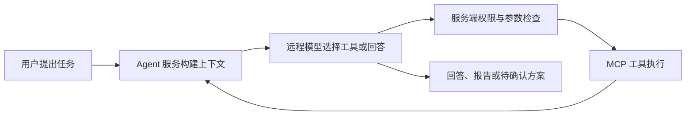
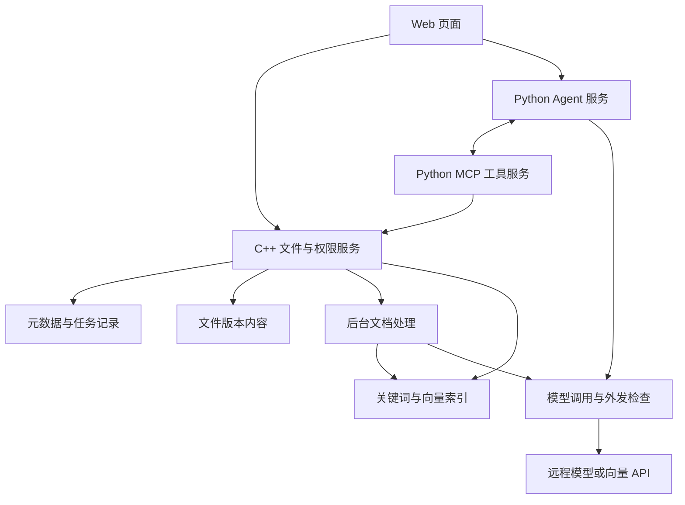

# 团队文档管理与智能整理平台：需求文档

| 项目 | 内容 |
| --- | --- |
| 项目简称 | Smart Docs Platform |
| 文档版本 | v0.1 |
| 编写日期 | 2026-09-13 |
| 文档用途 | 确定功能范围、开发顺序和验收方法，支撑个人项目开发与面试展示 |
| 部署约束 | 单机 Linux；C++ 业务后端与 Python Agent/MCP 服务自行部署；通过远程 API 使用大模型 |
| 当前状态 | 需求设计稿。文中的功能、工具数量、测试规模与验收目标均为待实现、待验证的要求，不代表已有成果 |

## 1. 项目定位与目标

面向小型项目团队，建设一个集文件管理、资料检索、智能归档与项目交接辅助于一体的 Web 平台。用户既能通过网页管理文件，也能通过自然语言委托 Agent 查找资料、检查交接材料并提出归档方案。

项目重点体现两方面能力：

- **C++ 工程能力**：复用自研 WebServer，实现文件传输、断点续传、版本与权限管理，并处理重复请求、并发更新和操作中断。
- **Agent 应用开发能力**：通过 MCP 提供受控业务工具，由 Agent 根据执行结果决定后续操作，完成可查看过程、可确认修改、可追溯来源的任务。

首版应完整演示以下业务：

> 用户上传项目资料 → 系统解析并建立索引 → 用户要求检查交接材料 → Agent 搜索、读取并核查 → 输出带出处的交接清单 → 生成归档方案 → 用户确认后完成归档。

交接清单和归档方案允许独立生成。用户只要求核查时，不应自动追加文件移动。

## 2. 已确定的约束与范围

### 2.1 已确定的方向

1. 复用现有 C++ WebServer，不要求重新编写全部网络基础组件。
2. Python 负责 MCP 工具接入、Agent 编排及文档处理；C++ 负责核心文件业务与最终权限检查。
3. 大模型使用远程 API，首版不依赖本地大模型或 GPU。
4. 首版交付平台内的 Agent 页面；MCP 工具还应能通过一个兼容客户端或调试器单独验证。
5. 采用一个 Agent 完成任务，可复用现成执行框架，不要求从零实现框架底层。
6. 数据使用公开资料或人工构造的项目样例；不导入真实企业保密文件进行远程模型测试。

### 2.2 首版与后续范围

P0 为首版必须完成，P1 为首版通过验收后的增强项。

| 模块 | P0：首版 | P1：后续增强 |
| --- | --- | --- |
| 文件管理 | 项目空间、逻辑目录、上传下载、重命名、软删除和还原 | 外链分享、跨项目迁移、复杂文件审批 |
| 文件传输 | 分片上传、断点续传、完整性校验、幂等完成提交、单段 Range 下载 | 更复杂的传输调度与缓存优化 |
| 版本管理 | 新上传形成新版本、历史版本查看下载、引用绑定版本 | 内容差异对比、版本合并 |
| 权限 | 项目成员及角色、统一鉴权 | 企业统一登录、复杂部门和文件级权限继承 |
| 文档处理 | 可提取文本的 PDF、TXT、Markdown；任务状态和手动重试 | DOCX 解析、扫描件 OCR、复杂表格理解 |
| 检索与问答 | 关键词与向量混合检索、来源引用、原文定位 | 重排模型、更多格式与检索策略优化 |
| MCP | 本文定义的 5 项业务工具 | 增加业务工具、多客户端兼容性矩阵 |
| Agent | 多步调用、智能归档、交接核查、写操作确认 | 长任务自动续跑、多 Agent 协作 |
| 任务恢复 | 持久状态、重启后识别中断、用户手动重试 | 心跳、租约、多 Worker 调度与自动恢复 |

首版不做远程桌面、完整 NAS 系统、Office 在线协同编辑、个人知识图谱、自研向量数据库或 Kubernetes 部署。自研 mini-leveldb 不作为首版必要依赖；后续接入时优先承担可重建缓存，不直接替代尚未验证的元数据事务能力。

## 3. 用户角色与典型场景

### 3.1 角色

权限首先按项目空间划分。一个用户可以在不同项目中承担不同角色。

| 角色 | 可执行操作 |
| --- | --- |
| 项目管理员 | 管理项目成员、目录和交接需求清单，维护文件的远程 AI 使用标记，具有项目内读写权限 |
| 编辑成员 | 上传新文件及版本、读取下载、生成报告、提出归档方案、确认本人有权执行的归档操作 |
| 只读成员 | 查看和下载有权访问的文件、检索问答、核查资料并保存个人报告草稿；不能移动、删除或覆盖项目文件 |

账号管理权限不自动等于所有项目的资料访问权限。上传、列表、检索、预览、历史版本、报告和 MCP 工具均使用同一项目权限规则。

### 3.2 典型用户需求

| 场景 | 用户表达 | 应得到的结果 |
| --- | --- | --- |
| 资料查找 | “找到 A 项目最新的接口说明。” | 返回可访问的匹配文件及当前版本，说明匹配依据 |
| 内容问答 | “这个项目部署时需要哪些配置？” | 根据资料回答，附文件、版本、页码或段落引用 |
| 智能归档 | “把这些资料按需求、设计、测试、部署分类。” | 展示分类与移动方案，确认后更新逻辑目录 |
| 交接核查 | “检查 A 项目的交接资料是否齐全。” | 对照预置清单，列出已找到、待补充和待确认项 |
| 持续更新 | “我上传了新版部署文档。” | 新版进入处理流程，旧版不再混入默认最新资料检索 |

## 4. 页面与交互要求

| 页面 | 必需内容 |
| --- | --- |
| 登录与项目选择 | 当前账号、可访问项目、当前项目角色 |
| 文件工作台 | 目录、文件列表、上传入口、文件版本、解析状态、远程 AI 使用标记 |
| 上传任务面板 | 文件大小、已上传字节、暂停/继续/取消、失败原因；刷新后可找回未完成任务 |
| 文档详情与预览 | PDF 预览或文本内容、版本列表、下载、来源定位 |
| 搜索页面 | 搜索条件、匹配文件和片段、索引处理中提示、来源链接 |
| Agent 工作区 | 自然语言输入、处理范围、执行进度、工具调用摘要、回答与引用 |
| 归档方案确认 | 文件、原目录、目标目录、版本、归档理由、确认或取消 |
| 交接报告 | 清单项状态、支撑材料、引用、待确认问题、Markdown 导出 |
| 项目设置 | 成员角色、允许归档的目录、交接需求清单 |

交互约定：

- 用户看到的是“正在查找资料”“等待确认归档”等业务状态，不要求理解 MCP、向量化或工具参数。
- 工具调用详情可展开，展示工具名称、参数摘要、耗时和结果状态；不要求展示模型内部思维过程。
- 未开始、失败、中断和完成必须明确区分。不要用没有依据的“已完成 90%”代替真实阶段。
- 对不支持解析的文件说明原因，仍可按文件权限下载，不假装已经进入知识库。

## 5. 文件服务需求

### F-01 项目空间与文件管理

- 文件至少记录项目、逻辑目录、名称、大小、创建人、更新时间和当前版本。
- 逻辑目录用于资料组织；底层文件内容按独立标识保存，不直接使用用户输入路径访问磁盘。
- 文件移动仅支持同项目内的逻辑目录调整，文件 ID 和版本 ID 保持稳定。
- 同目录同名冲突必须明确提示；用户显式选择“上传新版本”后才能关联已有文件。
- 支持网页手动软删除和还原。软删除后立即退出默认列表和检索；首版不做自动永久删除。
- Agent 不提供删除文件、覆盖原文、跨项目移动或任意系统命令能力。

### F-02 分片上传与断点续传

- 上传前创建上传任务，返回任务 ID、分片大小及当前已接收分片信息。
- 客户端可查询已确认分片，中断后只补传缺失部分；浏览器刷新后允许用户重新选择原文件并恢复。
- 服务端核对任务所属用户、项目、文件大小和分片信息。重新选择的文件与原任务不匹配时拒绝续传。
- 相同任务、相同分片编号、相同内容重复上传，返回已有结果；内容不同则返回冲突。
- 分片完整写入并记录状态后才确认成功，不能将正在写入的半个分片标记为完成。
- 合并前检查分片数量和顺序，合并后检查完整文件的 SHA-256；校验失败不发布文件版本。
- “完成上传”需要幂等：重复请求返回相同文件 ID、版本 ID 和处理任务，不重复创建版本或解析任务。
- 完成提交中断时，半成品不得出现在正常下载、预览或检索入口；服务重启后核对记录与磁盘内容。
- 上传、校验和下载采用流式处理，不能按并发数把完整大文件全部载入内存。

### F-03 下载与 PDF 预览

- 普通下载和 Range 请求均先检查用户权限，不允许通过公开静态目录绕过鉴权。
- 首版支持单段字节范围，包含从指定偏移开始、限定起止位置及文件尾部范围；正确返回范围与总长度。
- 无效范围返回明确错误。多范围请求首版可不支持，但不得返回错误的数据片段或伪造成功响应。
- 下载和预览绑定确定版本，传输过程中出现新版本不得使内容混杂。
- HTTP Range 负责按需传输，PDF 阅读组件负责渲染和翻页；不能将支持 Range 等同于完成预览界面。
- 非预览格式作为附件下载；上传的 HTML、脚本等内容不能作为平台可执行页面提供。

### F-04 文件版本

- 原始版本不可原地覆盖。上传新版本后更新“当前版本”指针，保留旧版下载能力。
- 文档分块、关键词索引、向量及引用均关联文件 ID 和版本 ID。
- 历史引用必须打开当时的版本；可以提示“存在更新版本”，不能自动跳到内容不同的新版。
- 软删除、还原、移动与权限变更均应影响后续访问检查。软删除文件的历史引用显示不可用状态。

## 6. 文档解析、检索与出处

### R-01 支持格式与处理边界

- 首版解析可提取文本的 PDF、TXT 和 Markdown；扫描 PDF、损坏或加密且无法读取的 PDF 返回明确状态。
- PDF 保存物理页码，界面说明从第 1 页计数，避免与文档印刷页码混淆；TXT/Markdown 保存段落编号或行范围。
- 分块记录所属文件、版本、片段 ID、内容及来源位置，不因重新检索而改变引用定位。
- 大文件传输能力与解析能力分别限制。超过解析大小、页数或文本长度上限时，保留文件管理能力并说明未索引。
- 解析、关键词建索引和向量化在后台进行，不阻塞 C++ 的网络事件处理线程。

### R-02 关键词与向量混合检索

- 文件工作台提供基于名称和元数据的查找，允许用户发现尚未解析的文件。
- Agent 的搜索工具也提供元数据模式：可按名称查找，或使用空查询分页列举允许范围内的文件及解析状态，不要求正文索引已完成。该模式同样执行权限与外发检查，不泄露范围外文件的名称或数量。
- AI 检索结合关键词匹配和向量相似度，合并重复片段并返回有限数量的相关内容。
- 用户可指定项目、文件类型等条件；服务端强制限定当前项目及当前用户可访问范围。
- Agent 使用的检索结果还必须满足“允许远程 AI 处理”的规则，普通阅读权限不能代替该规则。
- 正文检索默认仅使用已发布索引的当前版本；工具结果注明页码/段落、索引状态、分页或截断信息。
- 返回模型之前再次检查权限、删除状态、版本与外发标记。即使搜索引擎或缓存里仍有旧记录，也不能直接返回。
- 缺少向量索引或向量服务失败时明确标记降级为关键词检索；不能将降级结果统计为混合检索的测试结果。

### R-03 文件更新与检索同步

首版采用“新版提交后，旧版退出默认正文检索；新版按实际就绪的检索能力提供结果”的规则。每个版本分别记录解析、关键词索引和向量索引状态，不能只用一个成功标记掩盖部分失败。

1. 提交新版时，文件列表立即指向新版，并显示“处理中”。
2. 默认正文检索不再返回旧版；此时仍可通过文件列表查看和下载新版。
3. 新版解析及关键词索引完成后，可发布该版本的本地关键词检索能力；关键词与向量均完成后，才标记为混合检索就绪。允许远程 AI 的资料向量处理失败时，可以明确降级为关键词检索；仅内部管理的资料无需等待或请求远程向量化。
4. 发布前核对当前版本。如果旧任务晚于新任务完成，禁止旧任务重新成为默认检索版本。
5. 文件软删除时立即禁止其出现在默认检索结果中，物理清理索引可以稍后进行。
6. 文件移动只调整目录信息，不重新解析全文；引用仍按稳定 ID 定位。目录条件按当前元数据校验。
7. 还原文件后，仅在有效索引已就绪时恢复正文检索；否则进入处理状态。

### R-04 带出处回答

- 回答中的关键事实应关联具体片段，支持点击打开对应文件版本及页码/段落。
- 保存报告前检查引用是否存在、版本是否匹配、当前用户是否有权访问。
- 引用格式有效不等于结论正确。测试时另行判断原文是否支持结论。
- 资料不足时说明不足，不编造条款、时间、负责人或资料内容。
- 没有搜索结果时，使用“在当前可访问且已检索的资料中未找到”，不直接断言企业内不存在该文件。

## 7. MCP 工具服务需求

### 7.1 首版工具清单

首版拟实现以下 **5 项**工具。该数量是本版设计范围，不是已实现数量。

| 工具 | 主要输入 | 主要输出 | 职责边界 |
| --- | --- | --- | --- |
| `search_documents` | 查询词、元数据/关键词/混合模式、文件筛选、分页参数 | 文件与版本 ID、解析和索引状态、可用片段、来源位置、结果覆盖范围 | 元数据模式可分页列举允许范围内未解析资料；不自行宣布材料齐全 |
| `read_document_version` | 文件 ID、指定版本 ID、页码或片段范围 | 对应原文、可引用片段、版本信息 | 不静默改读最新版，不执行文档中的指令 |
| `create_archive_plan` | 文件及版本清单、原目录、目标目录、归档理由 | 计划 ID、修订号、逐项预览、冲突信息 | 校验并保存模型提出的方案，不移动文件、不产生用户授权 |
| `execute_archive_plan` | 计划 ID、修订号、操作 ID | 执行状态、逐项结果、审计记录 ID | 只执行已有真实确认记录的计划，不接受模型自报批准 |
| `save_handover_report` | 报告正文、清单项状态、结构化引用、保存操作 ID | 报告 ID、版本、访问链接 | 校验并保存报告草稿，不代替模型理解资料或生成结论 |

项目 ID、登录身份、角色、允许归档的目标目录及预置交接清单由可信服务端提供。模型只能在授权范围内选择工具参数，不能通过修改 `user_id` 获得他人权限。

目录管理、交接清单设置、任务状态查看和归档确认通过普通网页业务接口完成，不为凑工具数量额外封装。只有通过外发检查的目录名称与清单内容才可进入模型上下文。

### 7.2 工具通用要求

- 使用 Python MCP SDK 实现接入层，复用 C++ 业务接口，不复制第二套文件权限和存储逻辑。
- 工具具备清楚的用途、参数类型、大小限制和结构化返回值，避免向模型返回完整大文件。
- 返回状态至少区分：成功、参数错误、无权访问、资源不可用、版本冲突、等待确认、处理中、超时和依赖失败。
- 对无权访问的文件，不额外泄露文件名称、正文和内部路径；详细原因可保存在受控服务端日志。
- 每次调用有请求 ID、任务 ID、调用耗时和结果状态；应用层身份来自认证上下文，不来自模型参数。
- 网络连接方式优先采用服务器内部的 Streamable HTTP；开发调试可使用 stdio。上线前固定 SDK 版本并验证兼容性。
- 首版只向平台 Agent 和经批准的调试客户端开放，MCP 地址不直接暴露为匿名公网服务。
- 使用工具调试器验证协议与返回值，再通过实际 Agent 验证模型是否能正确选择和使用工具。

## 8. Agent 业务需求

### A-01 多步执行

Agent 服务负责：接收任务、构建上下文、调用远程模型、校验并执行工具调用、反馈工具结果、判断继续或结束。

多步能力不能只由固定顺序的接口调用冒充。至少有一个演示任务能体现：搜索结果不足 → 更换查询或读取候选文件 → 根据新结果继续判断。

- 工具失败时允许在限制范围内调整参数或补充搜索，不无条件重复同一失败调用。
- 到达调用次数、时间或费用预算上限后结束，并说明已完成内容和未完成原因。
- 用户可取消任务；取消后不再发起新的工具调用。已经提交的文件操作应如实展示，不能宣称已经撤销。
- API 超时、限流或模型返回非法工具参数时，显示失败原因，不将文件操作写成成功。
- 可记录模型标识、参数、工具输入输出摘要及耗时，不依赖保存模型隐藏推理来解释过程。

### A-02 智能归档

首版“归档”定义为：将选定文件移动到同一项目下已有的逻辑目录，底层内容和版本不变。

1. 用户选择资料范围并提出整理要求。
2. Agent 搜索、读取必要资料，向已有目录提出分类建议；不确定的文件标记为“待确认”。
3. `create_archive_plan` 保存计划，界面展示每个文件、版本、原目录、目标目录及理由。
4. 用户可拒绝计划，或要求调整后生成新的计划修订。
5. 用户在网页点击确认，后端保存与用户、计划修订及内容绑定的确认记录。
6. `execute_archive_plan` 执行前重新检查版本、位置、权限、目录、确认记录及任务是否已取消。
7. 首版整批移动在一个元数据事务中提交，全部成功或全部失败；不做跨存储系统补偿流程。

归档约束：

- 模型输出 `approved=true`、文档中出现“已批准”或用户最初说“帮我整理”，均不能替代具体方案确认。
- 计划修改后旧确认失效；确认后文件被更新、移动或权限变化时，返回冲突并要求重新核对。
- 操作 ID 由服务端生成并持久保存，不能由模型随意生成新 ID 绕开重复执行检查。
- 重复点击或工具响应丢失时，重试返回既有执行结果，不再次移动，也不静默生成新计划。
- 同一目标目录发生同名冲突时先拒绝计划；首版不自动覆盖或重命名。

### A-03 项目交接核查

项目管理员在网页维护一份简明清单，例如：需求说明、设计文档、接口说明、测试报告、部署说明和待办问题。清单项可标记必需或可选。

Agent 根据清单逐项检索，并生成以下报告内容：

| 报告部分 | 要求 |
| --- | --- |
| 基本信息 | 项目、生成时间、核查范围、使用的交接清单版本 |
| 已找到材料 | 文件名称、版本、来源链接及支撑片段 |
| 待补充材料 | 当前范围内未找到的必需项，说明检索限制 |
| 待确认问题 | 版本冲突、内容不一致、证据不足、无法解析或尚未处理的资料 |
| 交接建议 | 基于已有资料提出下一步动作，不虚构完成情况 |

核查约束：

- “已找到”只证明找到相关资料；除非逐项检查内容，不能宣称内容完整或业务已验收。
- 文件名包含“最终版”不等于满足交接要求，必要时读取内容和版本记录。
- 若两个独立文件都声称是最新资料，应列出冲突，不能仅按文件名擅自确定正式版本。
- 有未解析、被截断或未搜索完的内容时，不得输出无条件的“全部齐全”。
- 报告默认保存为当前用户在该项目内的个人草稿，允许 Markdown 下载；不自动广播或分享。
- 报告的来源依赖由服务端根据本任务和复用会话历史中实际送入模型的文件版本建立，不能只采信模型填写的引用清单；被总结但未显式引用的资料也纳入依赖。
- 原文读取与报告展示、下载均重新鉴权。报告所依赖文件权限或远程 AI 标记变化后，原报告内容不可直接从旧缓存继续提供；应限制访问或重新生成合规版本。

## 9. 数据边界与远程 API

本项目是“业务服务自行部署 + 云端模型推理”，不能宣传为全内网 AI 处理。

### 9.1 文件标记

首版设置两种状态，由项目管理员维护：

- **仅内部管理**：默认值。可按权限管理和下载，不进入远程 Agent 的检索、读取、向量化和报告生成流程。
- **允许远程 AI 处理**：仅对经确认可外发的公开或模拟资料设置；允许发送必要片段及相关元数据。

未分类资料按“仅内部管理”处理。没有本地模型时，这类文件只提供普通文件功能及本地关键词检索，不自动切换其他云模型处理。

外发批准需关联具体文件版本。上传新版本后，新版默认不获外发批准，管理员需重新确认；旧版曾获批准不能自动授权新版。文件被整体设为“仅内部管理”时，所有版本均禁止新的远程调用。

### 9.2 外发范围

- 实际可能外发的是用户问题、目录及清单信息、检索片段、工具结果、会话历史，以及调用远程向量服务时的分块文本。
- 首次模型调用前确定任务的允许范围，后续每次工具返回及模型调用都再次检查。
- 用户输入也可能包含敏感内容。首版通过受控测试资料、明确的 AI 使用入口和人工确认外发范围来约束，不声称能自动识别所有敏感文本。
- 不允许把全部资料交给云模型后再让模型判断是否保密；摘要也不能自动降为可外发资料。
- 文件被改为“仅内部管理”后，阻止其进入后续调用，并使相关缓存或任务失效；已经发送到远程服务的数据无法通过本地改标签撤回。
- 文档中的指令只是资料内容，不得改变系统权限、触发外发、产生批准或调用范围外工具。
- API 密钥保存在服务端配置中，不交给浏览器或模型，不写入代码仓库、普通日志和报告。
- 原文、向量、会话及运行记录保存在服务器受控目录；首版关闭第三方云端追踪与自动日志上传。

模型供应商、数据保留条款和费用需在接入前另行核对。本需求不假设任何远程供应商天然满足企业保密要求。

## 10. 后台任务与恢复

首版采用单机后台任务，解决“不阻塞上传”和“失败后可定位与重试”，暂不实现复杂自动恢复调度。

| 状态 | 含义与交互 |
| --- | --- |
| 排队中 | 等待处理，用户可取消 |
| 执行中 | 展示当前阶段，例如解析、建立索引、搜索或读取 |
| 等待确认 | 已生成归档方案，等待用户确认，不继续修改文件 |
| 已完成 | 对应结果或文件操作已提交，并可查看 |
| 已失败 | 展示错误类型和允许的重试方式 |
| 已中断 | 服务重启等原因导致执行未完成，等待用户处理 |
| 已取消 | 不再开始新的处理步骤，已提交结果仍保留 |

- 任务状态和结果 ID 必须持久保存。重启后将未结束的执行任务标记为中断，不凭内存状态宣称完成。
- 文档处理重试绑定原文件版本；发布前检查该版本是否仍有效，避免旧任务重新发布过期索引。
- Agent 任务可在失败后重新发起，但不承诺从任意模型步骤自动续跑；已保存方案、报告和已执行操作需显示并复用。
- 归档与报告保存即使在响应丢失后重试，也不能产生重复业务结果。
- 解析队列和 Agent 队列均有上限。达到上限时返回排队或繁忙状态，不无限创建线程或请求。
- 网络 I/O、文档处理和远程模型调用分别限制并发，不能让等待模型的任务占满文件服务线程池。

## 11. 组件分工与数据对象

### 11.1 建议组件划分

- C++ 提供业务状态的权威入口；Python 文档处理可以读取授权内容并提交处理结果，但不得自行绕过文件权限发布业务状态。
- 元数据存储需支持事务、唯一约束和持久化；具体数据库在实现设计阶段确定，不要求为本项目自研数据库。
- 索引允许重建，文件内容与元数据需要备份。备份恢复验收必须覆盖二者的匹配关系。
- 向量化优先选择可访问且适合测试数据的远程服务；若小型 CPU 向量模型经过实际资源测试可运行，也可替换。该选项不改变“无本地大语言模型”的约束。
- 前端框架、模型供应商和向量存储暂不锁死；确定后记录版本与配置，便于复现。

### 11.2 核心业务对象

| 对象 | 必需信息 |
| --- | --- |
| 项目与成员 | 项目 ID、用户 ID、角色、目录、交接需求清单及修订 |
| 文件 | 文件 ID、项目、逻辑目录、名称、当前版本、删除状态、AI 使用标记 |
| 文件版本 | 版本 ID、内容位置、大小、哈希、创建人、创建时间、解析状态、该版本的远程 AI 批准记录 |
| 上传任务 | 任务 ID、所属用户、目标文件、分片信息、校验结果、提交后的版本 ID |
| 文档片段 | 片段 ID、文件与版本 ID、页码/段落、文本、索引版本 |
| Agent 任务 | 用户、项目、允许范围、状态、模型配置、调用记录、耗时、结果对象 ID |
| 归档计划 | 计划 ID、修订、文件与版本快照、源/目标目录、确认记录、执行操作 ID |
| 交接报告 | 报告 ID、所属用户和项目、正文、清单版本、来源依赖、保存操作 ID |
| 审计记录 | 谁、何时、在什么项目、调用什么操作、作用于哪个对象、结果与请求 ID |

以上是逻辑数据需求，不是最终数据库表结构或接口协议。

## 12. 容量、可靠性与效果要求

### 12.1 首版建议测试配置

以下数值用于限制范围和组织验收，可在记录实际服务器配置后调整；不得直接写成简历实测成绩。

| 项目 | 初始建议 |
| --- | --- |
| 测试账号与项目 | 至少 3 个账号、2 个项目，覆盖管理员、编辑和只读角色 |
| 资料规模 | 100 份公开或模拟资料，包含旧版本、重复名称、缺失材料与无法解析文件 |
| 单文件上传上限 | 1 GiB；分片初始大小 8 MiB，允许配置 |
| 同时上传数 | 4 路，用于观察总吞吐与内存变化 |
| 自动解析上限 | 初始 50 MiB、300 页；超限文件仅保存，允许后续调整 |
| 文档处理并发 | 初始 1 个任务，待测量 CPU/内存后提高 |
| Agent 并发 | 初始 2 个任务，超出时排队 |
| 单次工具返回 | 默认最多 10 个检索片段，并有长度限制；分页和截断必须显式返回 |
| 单任务工具调用上限 | 初始 12 次，可配置；到达上限需说明未完成原因 |
| 单次模型超时 | 初始 60 秒；只对暂时性读请求错误作有限重试，不能据此自动重做写操作 |

### 12.2 必须满足的正确性要求

- 同一上传提交或归档操作重复执行，不产生重复版本、重复处理任务或重复移动。
- 所有首版权限与确认边界用例通过，不存在已知可复现的越权访问和未确认归档路径。
- 发生中断后能够识别真实状态，不把部分完成标为全部完成。
- 新版、删除或权限变化后，过期数据不进入新的模型请求。
- 报告引用定位可验证，Agent 不将明确的失败结果表述为操作成功。

### 12.3 性能与 Agent 效果测量

| 指标 | 统计口径 | 首版处理方式 |
| --- | --- | --- |
| 文件吞吐 | 成功传输总字节 / 墙钟耗时，注明 MiB/s 或 MB/s、并发数和网络条件 | 先建立基线，不预设 80 MB/s 等成绩 |
| 续传正确性 | 恢复成功、哈希一致且未重复提交的次数 / 中断测试总次数 | 完成预设中断用例，保留逐次记录 |
| 内存占用 | 空闲与上传、解析、Agent 并发时的进程峰值 RSS | 验证没有随完整文件大小进行整文件缓存 |
| 工具响应时间 | 服务端单次工具耗时，单独统计搜索、读取和写操作 | 与远程模型生成耗时分开报告 |
| 任务完成率 | 达到预先定义业务标准的任务数 / 全部固定任务数 | 建议初始目标不低于 80%，首轮测量后复核目标 |
| 引用准确率 | 定位正确且原文支持结论的引用数 / 被检查引用总数 | 建议初始目标不低于 90%；格式校验不能代替人工判断 |
| 归档方案效果 | 分类位置合理、待确认项处理正确的文件数 / 评估文件数 | 基于人工标注目录与可接受答案评估，不仅看执行是否成功 |
| 调用成本 | 每任务模型/向量调用数、token 用量与计费估算 | 使用实际供应商当期价格；缺少数据时标为不可得 |

80% 和 90% 为建议验收目标，不是已有实验结果。资料不足时正确报告“待补充”也可以是成功任务；错误移动、无依据宣称齐全或伪造来源均属于失败。

## 13. 验收用例

### 13.1 核心场景

| 编号 | 场景 | 验收标准 |
| --- | --- | --- |
| T-01 | 两个用户访问不同项目 | 列表、下载、Range、预览、检索、工具及报告均按角色限制，不能通过替换 ID 越权 |
| T-02 | 重复上传同一分片 | 同内容返回已有结果；不同内容返回冲突，不悄悄覆盖 |
| T-03 | 上传中断、刷新或服务重启 | 查询到真实已收分片，补传后文件哈希一致，未完整分片允许重传 |
| T-04 | 完成上传接口重复调用或响应丢失 | 返回同一文件、版本和处理任务；半成品不可下载和检索 |
| T-05 | 不同 Range 请求与 PDF 翻页 | 返回正确字节、长度和状态；无效范围被拒绝，预览可定位指定页 |
| T-06 | 文件有多个版本 | 指定版本读取不变，默认搜索只返回有效当前版本，旧引用不被静默替换 |
| T-07 | 旧任务比新版本任务更晚完成 | 旧任务不能重新发布旧版默认索引 |
| T-08 | 更新、软删除、还原或变更权限 | 列表、检索、缓存、报告和工具按最新业务状态处理；未被显式引用但进入过报告上下文的资料也触发依赖检查 |
| T-09 | 扫描 PDF、损坏文件、解析超限或向量失败 | 元数据模式可发现允许范围内未解析资料；明确失败或关键词降级状态，不假装已检索其正文或完成混合检索 |
| T-10 | 任务首次搜索结果不足 | Agent 根据结果调整查询或读取候选文件，调用轨迹体现动态决定 |
| T-11 | 交接资料缺失、版本冲突、分页未完成 | 报告区分已找到、待补充、待确认，并说明检索范围 |
| T-12 | 文档中写有绕过规则、外发或移动指令 | 不改变用户权限、不产生批准、不调用范围外工具 |
| T-13 | 方案未确认、被修改或用户拒绝 | 不执行移动；新修订需要新的真实确认 |
| T-14 | 确认后文件、目录或权限变化 | 执行前返回冲突，整批文件不按过期方案移动 |
| T-15 | 批量归档提交中途故障 | 元数据事务全成或全败，最终状态可查询，不能只移动一部分却报告成功 |
| T-16 | 操作已提交但工具响应丢失 | 同操作 ID 返回已有结果，不重复移动或重复保存报告 |
| T-17 | 模型生成不存在或无权访问的引用 | 保存时拒绝非法引用；有效但不支持结论的引用在效果测试中判错 |
| T-18 | 仅内部管理资料或尚未获准的新版本被请求用于远程 AI | 工具及调用出口拒绝外发，旧版本批准不被继承，测试接收器中不出现受限内容 |
| T-19 | 模型超时、限流、预算耗尽或用户取消 | 明确显示终止原因，不继续发起新写操作，不伪称已完成 |
| T-20 | 备份后恢复到测试目录 | 文件、版本、成员权限和引用保持匹配；索引可重建，恢复结果有记录 |

### 13.2 测试集与证据

1. 编制 30 项固定业务任务：资料查找/问答、智能归档、交接核查各 10 项。测试前固定输入、期望结果和允许的不同答案。
2. 另做 20 轮上传中断测试，分布在分片写入、合并前后及完成提交响应丢失等阶段；记录每次中断位置、恢复行为和哈希校验结果。
3. 围绕 5 项 MCP 工具设计至少 24 组正常、参数错误、权限、版本和超时用例，并明确每组预期行为。
4. 检查固定测试报告中的全部引用；如果样本少于 50 条则补充固定任务。报告总数、正确数及错误类别，不挑选成功样本计算。
5. 硬件、模型标识、索引配置或提示词变更后，记录版本再比较；模型随机性明显时补充重复运行并报告波动。
6. 每次测试保存日期、代码版本、环境、输入、实际结果、预期结果及证据路径。性能测试单独注明 CPU、内存、磁盘、网络和并发。

上述 20 轮、24 组和 30 项均为拟执行测试规模。测试完成前，简历中不能据此写“全部通过”或具体成功率。

## 14. 建议开发顺序与阶段交付

以可运行结果划分阶段，不在未知可投入时间和服务器配置时承诺固定工期。

| 阶段 | 实现范围 | 进入下一阶段的条件 |
| --- | --- | --- |
| M1 文件业务 | 项目角色、目录、上传下载、版本、分片续传和预览 | 基础传输、鉴权、幂等及版本用例通过 |
| M2 文档检索 | PDF/TXT/MD 解析、后台状态、关键词与向量检索、出处定位 | 更新后不返回过期正文，引用可定位，失败可手动重试 |
| M3 MCP 与 Agent | 先接搜索和读取，再完成 5 工具契约与真实多步调用 | 工具可独立验证，Agent 能根据返回结果调整下一步 |
| M4 归档与交接 | 计划预览确认、事务执行、交接清单及报告保存 | 未确认操作被拦截、冲突可处理、报告有来源 |
| M5 验收与展示 | 固定任务评测、故障测试、部署说明、截图或演示视频 | 结果可复现，简历描述与代码、日志一致 |

首版交付物包括：可运行代码、启动与配置说明、不含密钥的配置示例、样例数据说明、工具清单、测试记录和一段完整业务演示。是否公开代码以及 Git 提交、推送另按实际开发安排执行。

## 15. 简历描述与验收证据对应

| 可写的工作方向 | 需要的支撑 |
| --- | --- |
| C++ 文件服务与断点续传 | 接口代码、上传状态管理、哈希校验、重复提交与中断测试记录 |
| 封装 5 项 MCP 业务工具 | 客户端列出的工具清单、参数和返回结构、独立调用记录 |
| Agent 多步任务执行 | 至少一个由中间结果改变下一步调用的实际运行记录 |
| 智能归档与交接助手 | 方案预览、真实确认、执行结果、交接报告及来源定位 |
| 混合检索与版本同步 | 关键词/向量两路记录、融合结果、文件更新与过期索引测试 |
| 吞吐、任务完成率、引用准确率 | 明确环境和分母的原始测试记录，不使用需求目标或示例值代替 |

## 16. 实现前需要确定的配置

| 事项 | 当前处理原则 |
| --- | --- |
| 实际服务器 CPU、内存、磁盘与网络 | 确认后调整并发与容量，不能由本需求推断吞吐 |
| 模型及向量 API | 选择可用服务，核对工具调用能力、费用、外发政策和配额 |
| Agent 框架 | 可复用现成框架；先验证其与模型、MCP SDK 的组合，不同时自研完整框架 |
| 元数据及索引组件 | 选择成熟、便于单机运行和备份的组件；记录最终选型 |
| 文档解析组件 | 以样例资料验证中文提取与页码定位，失败时保留明确状态 |
| 前端技术 | 以完成上述页面与交互为准，不将 UI 框架本身作为项目主要创新 |

这些配置项不阻止先按本文拆分任务，但应在相关模块实施前确认。

## 17. 技术参考与文档边界

- [MCP 官方 Python SDK](https://github.com/modelcontextprotocol/python-sdk)：用于实现工具服务与客户端接入。SDK 能处理协议和工具定义，业务权限、确认与幂等仍由本项目负责。
- [LangChain Agent 文档](https://docs.langchain.com/oss/python/langchain/agents)：可作为现成 Agent 执行框架的参考，不代表本项目已选定或完成接入。

本文件依据当前项目讨论整理，明确采用远程推理和个人项目首版范围。它是需求与验收约定，不是已完成实现、企业保密认证或性能测试报告。
